# Architecture

Status: **Phases 0–7 built** · Owner: platform team · Related: `DATA_MODEL.md`, `UI.md`, `DECISIONS.md`

## 1. System overview

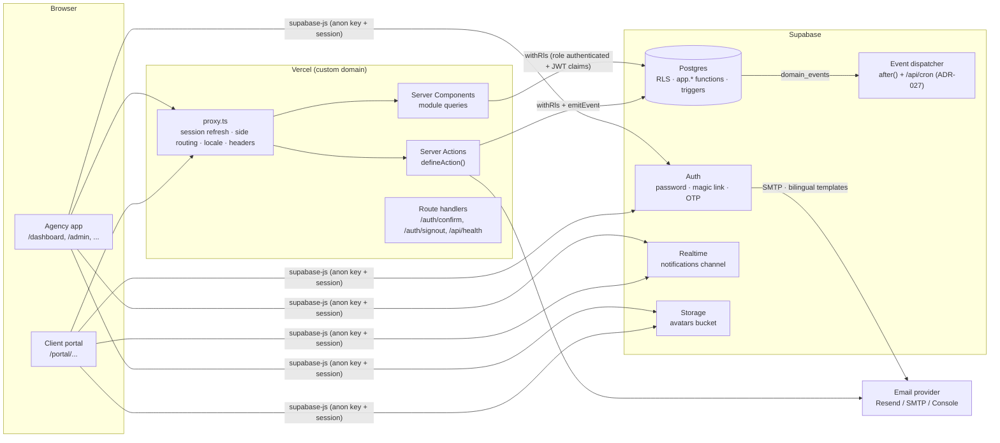

Key properties:

- **One Next.js app, two sides.** Route groups `(agency)` and `(portal)` have separate layouts, navigation
  and guards but share auth, design system and modules.
- **Postgres is the authorization authority.** RLS policies call `app.has_permission()`. The app never
  bypasses RLS for user-initiated work.
- **Event-first mutations.** Every important mutation writes a `domain_events` row in the same transaction;
  future consumers (notifications, automations, AI) subscribe to it without touching the producer.

## 2. Folder structure

```
.
├── CLAUDE.md
├── docs/                          # ARCHITECTURE, DATA_MODEL, UI, ROADMAP, DECISIONS
├── supabase/
│   ├── config.toml                # local stack config (auth hooks, email, ports)
│   ├── migrations/                # SQL — drizzle-kit generated + hand-written (RLS, functions, triggers)
│   ├── seed.sql                   # static reference data (permissions catalog, system roles, flags)
│   └── functions/                 # Edge Functions (Phase 1+: event dispatcher)
├── scripts/
│   ├── seed.ts                    # dev data: agency, ~10 users (via Auth admin API), departments, demo client
│   └── check-i18n.ts              # ar/en key parity
├── emails/                        # React Email templates (invite, magic-link, reset, verify, notification digest)
├── messages/                      # shared i18n namespaces (common, nav, errors, validation)
│   ├── ar/*.json
│   └── en/*.json
├── e2e/                           # Playwright specs + fixtures
├── src/
│   ├── proxy.ts                   # Next 16 "proxy" (formerly middleware)
│   ├── app/
│   │   ├── layout.tsx             # <html lang dir>, fonts, theme, providers
│   │   ├── (auth)/                # /login, /magic-link, /forgot-password, /reset-password,
│   │   │                          # /verify-email, /invite/[token], /onboarding
│   │   ├── (agency)/              # agency layout (sidebar + top bar) — URLs at root
│   │   │   ├── dashboard/
│   │   │   ├── notifications/
│   │   │   ├── settings/          # profile, preferences, notification prefs
│   │   │   └── admin/             # users, invitations, roles, permissions matrix, departments,
│   │   │                          # features, audit log, organization, packages
│   │   │   ├── clients/ messages/ # Phase 1: client management + agency inbox
│   │   │   └── dev/design-system/ # component showcase (design_system:view)
│   │   ├── (portal)/portal/       # client layout — URLs under /portal
│   │   │   ├── page.tsx           # portal home (Phase 0: welcome + profile; Phase 1 fills it)
│   │   │   ├── files/ messages/ company/ notifications/ settings/
│   │   │   └── requests/ approvals/ calendar/  # flag-guarded, upcoming phases
│   │   ├── auth/confirm, auth/signout   # email-link verification, sign out
│   │   └── api/health/
│   ├── components/
│   │   ├── ui/                    # shadcn/ui primitives (owned, themed)
│   │   ├── shell/                 # AppShell, Sidebar, TopBar, Breadcrumbs, CommandPalette
│   │   └── patterns/              # PageHeader, DataTable, EmptyState, StatCard, FileCard, AvatarGroup, ...
│   ├── lib/
│   │   ├── auth/                  # getSession, requireUser, requireSide, session types
│   │   ├── db/                    # drizzle client, withRls(), dbAdmin (service), schema barrel
│   │   ├── permissions/           # can(), loadPermissions(), permission catalog types
│   │   ├── events/                # emitEvent(), event registry & payload types
│   │   ├── flags/                 # isFeatureEnabled(), module registry
│   │   ├── actions/               # defineAction(), Result type, error codes
│   │   ├── email/                 # EmailProvider interface, Resend/SMTP/Console providers, sendEmail()
│   │   ├── i18n/                  # next-intl request config, formats, localized(), DirIcon
│   │   ├── supabase/              # browser/server clients, admin client
│   │   └── utils/
│   ├── modules/
│   │   ├── organizations/         # org settings, feature flags, logo upload
│   │   ├── identity/              # auth actions, profiles, onboarding, avatars, preferences
│   │   ├── invitations/           # tokens, team/client invites, acceptance
│   │   ├── rbac/                  # roles, permission matrix, overrides, team admin
│   │   ├── departments/
│   │   ├── clients/               # clients, portal users, packages + usage ledger
│   │   ├── files/                 # folders, uploads (signed URLs), previews
│   │   ├── messaging/             # threads, comments, mentions, read receipts
│   │   ├── requests/              # request types + form builder, requests, triage, SLA, dashboard stats
│   │   ├── notifications/         # notify(), bell, inbox, preferences
│   │   ├── portal/                # portal home read models
│   │   ├── dashboard/             # agency dashboard read models
│   │   ├── audit/                 # activity_log viewer
│   │   └── design-system/         # /dev/design-system showcase
│   └── styles/globals.css         # design tokens (CSS variables), Tailwind v4 @theme
└── tests/
    ├── unit/                      # permission helper, formatters, schemas
    └── db/                        # RLS integration tests (per table, allow + deny)
```

## 3. Routing & side separation

| Surface | URL space | Route group | Allowed `user_type` |
|---|---|---|---|
| Auth | `/login`, `/magic-link`, `/forgot-password`, `/reset-password`, `/verify-email`, `/invite/[token]`, `/onboarding` | `(auth)` | anyone (onboarding: signed-in, not onboarded) |
| Agency | `/dashboard`, `/notifications`, `/settings/*`, `/admin/*` (+ future `/clients`, `/tasks`, …) | `(agency)` | `agency` |
| Portal | `/portal/*` | `(portal)` | `client` |
| Dev | `/dev/design-system` | `dev` | agency staff in prod; anyone locally |

URL design keeps a future split to subdomains (`app.<domain>` / `portal.<domain>`) a proxy rewrite, not a refactor.

**Three layers of enforcement**

1. **`proxy.ts`** — refreshes the Supabase session cookie, reads custom JWT claims (`user_type`, `org_id`,
   `onboarded`), redirects: unauthenticated → `/login?next=…`; not onboarded → `/onboarding`;
   client on agency URL → `/portal`; agency user on `/portal` → `/dashboard`. Cheap, no DB call.
2. **Layout guards** — `(agency)/layout.tsx` calls `requireSide('agency')`, `(portal)/layout.tsx` calls
   `requireSide('client')`. These re-validate against the DB (`getUser()` + membership), so a stale JWT can't
   slip through.
3. **RLS** — agency-only tables check `app.is_agency_member(org)`; client data checks `app.client_access(client_id)`.

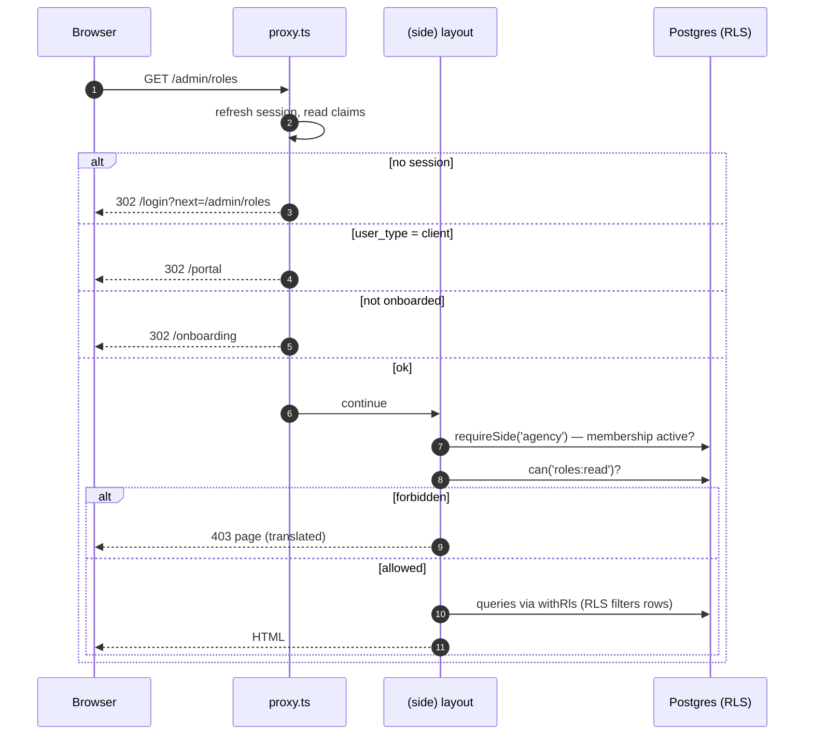

## 4. Authentication

Supabase Auth handles identities and sessions (`@supabase/ssr`, HTTP-only cookies).

| Flow | Mechanism |
|---|---|
| Email + password | `signInWithPassword`. Public sign-up is **disabled** — accounts are created only via invitation (and seed). |
| Magic link | `signInWithOtp({ shouldCreateUser: false })` — existing users only. |
| Password reset | `resetPasswordForEmail` → `/reset-password` (PKCE code exchange) → `updateUser({ password })`. |
| Email verification | Invited users are verified by accepting the emailed token. Email changes use Supabase "secure email change" → `/verify-email`. |
| Invitations | Our own `invitations` table (not Supabase's invite) for full control: hashed token, expiry (7 days), resend (rotates token), revoke, role(s) + department/client pre-assigned. |
| Onboarding | First login when `profiles.onboarded_at is null`: name, avatar, phone (E.164, SA default), language. |

**Auth emails** (magic link, reset, email change) use GoTrue's own bilingual templates in `supabase/templates/`
(language from `user_metadata.locale`, kept in sync when the user switches language). Links land on
`/auth/confirm?token_hash=…&type=…`, which calls `verifyOtp` server-side — no PKCE state, works across devices.
Invitation and notification emails are rendered with React Email and sent through `EmailProvider` (ADR-017).

**Custom access token hook** (Postgres function `app.custom_access_token_hook`) adds claims:
`org_id`, `user_type` (`agency` | `client`), `client_id` (clients only), `onboarded` (bool).
Permissions are **not** put in the JWT (they would go stale for up to an hour); they're evaluated live in DB.

### Invitation flow

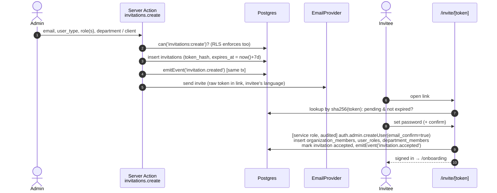

Resend = new token + new expiry, old token invalid. Revoke = status `revoked`. Accepting an expired /
revoked / used token shows a translated explanation and "ask for a new invite".
If the email already has an account in the org, invite creation is rejected with `already_member`.

## 5. Authorization (RBAC)

### Model

- **Permissions** are a seeded catalog of `resource:action` keys, each with a `side` (`agency` | `client`)
  and localized label/description. Modules declare them in `permissions.ts`; a migration seeds them.
- **Roles** belong to an organization, have a `side`, and a set of permissions (`role_permissions`).
  System roles (`is_system`) can be edited but not deleted; **Super Admin is locked** to all permissions.
- **User roles** (`user_roles`) assign roles to a member within an organization (and within a client for
  client-side roles).
- **Overrides** (`user_permission_overrides`) grant or deny a single permission to a single user.
  **Effective = (∪ role permissions ∪ grants) − denies.** Deny wins.
- **Data scope** (e.g., Account Manager sees only *assigned* clients) is expressed as distinct permissions
  (`clients:read_all` vs `clients:read_assigned`) + relationship checks in the table's RLS policy.
  Permissions stay binary; RLS combines them with relationships.

### Postgres functions (source of truth)

```sql
app.current_user_id() -> uuid                        -- auth.uid()
app.is_org_member(org uuid) -> bool                  -- active membership
app.is_agency_member(org uuid) -> bool
app.has_permission(org uuid, perm text) -> bool      -- effective permission, deny-wins
app.has_client_permission(client uuid, perm text) -> bool -- client-side roles scoped to a client
app.effective_permissions(org uuid) -> setof text    -- used by the app to build can()
```

All `stable`, `security definer`, `set search_path = ''`, owned by a non-login role, `execute` granted to
`authenticated` only. Indexed lookups; per-statement caching via `(select app.has_permission(...))` in policies.

### TypeScript `can()`

```ts
const perms = await loadPermissions();        // one call: app.effective_permissions(org) — cached per request (React cache)
can(perms, 'roles:update');                   // pure function — used in Server Components, actions, and client UI
<Can permission="users:invite">…</Can>        // client component reads a serialized Set passed from the layout
```

`can()` never replaces RLS; it hides UI and rejects early with a nice error. Unit tests cover deny-wins,
side mismatch, locked Super Admin. RLS tests prove the DB rejects the same operations directly.

## 6. Data access: `withRls` and `defineAction`

```ts
// src/lib/db/rls.ts
await withRls(session, async (tx) => { … })
// BEGIN;
//   select set_config('request.jwt.claims', <jwt claims json>, true);
//   set local role authenticated;
//   …queries… (RLS applies, auth.uid() works, triggers see the actor)
// COMMIT;
```

```ts
// src/modules/rbac/server/actions.ts
export const updateRolePermissions = defineAction({
  input: updateRolePermissionsSchema,          // Zod
  permission: 'roles:update',                  // early can() check
  async handler({ input, tx, ctx }) {
    const before = await getRolePermissions(tx, input.roleId);
    await replaceRolePermissions(tx, input.roleId, input.permissionKeys);
    await emitEvent(tx, {
      type: 'role.permissions_updated',
      aggregate: { type: 'role', id: input.roleId },
      payload: { added, removed },
    });
    return { roleId: input.roleId };
  },
  revalidate: ['/admin/roles'],
});
```

`defineAction` guarantees: input validation → session → side check → `can()` → `withRls` transaction →
handler → commit → `revalidatePath` → `Result<T>` with translatable error codes. Rate limiting is opt-in per action.

## 7. Domain events

```ts
emitEvent(tx, { type, aggregate: { type, id }, payload, clientId? })
```

- Inserted into `domain_events` **in the same transaction** as the mutation (transactional outbox) by the
  `emitEvent()` TS helper; RLS only lets a member insert events whose `actor_id` is themselves.
- Event types are a typed registry (`src/lib/events/registry.ts`); payloads are Zod-validated in dev/test.
- Phase 0 events: `user.invited`, `invitation.resent`, `invitation.revoked`, `invitation.accepted`,
  `user.onboarded`, `user.profile_updated`, `user.deactivated`, `user.reactivated`, `role.created`,
  `role.updated`, `role.deleted`, `role.permissions_updated`, `user.roles_changed`,
  `user.permission_override_set`, `department.created`, `department.updated`, `department.members_changed`,
  `feature_flag.toggled`, `organization.updated`.
- **Consumers (Phase 2, ADR-027)**: `src/lib/events/dispatcher.ts` + the registry in `src/lib/events/consumers.ts`.
  After every committed `defineAction`, `scheduleEventDispatch()` runs the dispatcher via `after()`; the cron route
  `/api/cron/dispatch-events` (Bearer `CRON_SECRET`) is the safety net. Per pass:
  1. insert a `domain_event_deliveries (event_id, consumer)` row for each recent event (≤ 2 days) a consumer subscribes to;
  2. claim due rows (`processed_at is null`, `next_attempt_at <= now()`, lease expired) with `for update skip locked`,
     set `locked_until = now() + 2 min`, `attempts + 1`;
  3. run the handler → `processed_at = now()`, or `last_error` + `next_attempt_at = now() + backoff` (30 s × 2ⁿ, ≤ 1 h, 8 attempts).
  Handlers must be idempotent (`notify()` skips recipients already notified for the event).
- Current consumers — all notification fan-out (ADR-028): `notifications.messages` (`comment.created` → message / mention,
  request threads link to the request page), `notifications.files` (`file.uploaded`), `notifications.requests`
  (`request.submitted | assigned | status_changed`), `notifications.invitations` (`invitation.accepted`),
  `notifications.roles` (`user.roles_changed`). Automations (Phase 7) and AI indexing (Phase 8) add consumers here.

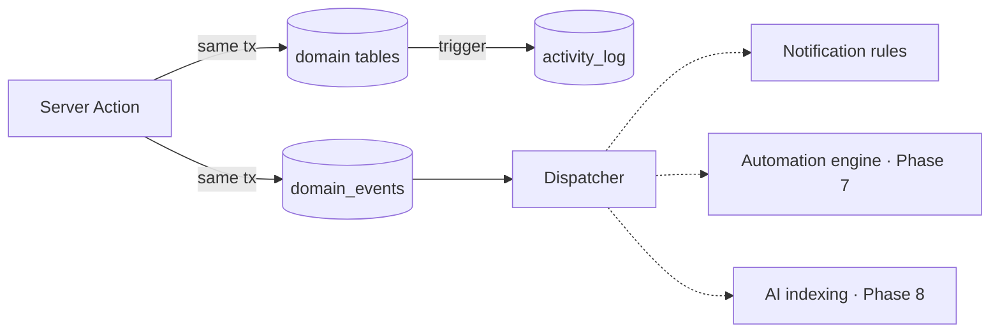

**Audit vs events** — `activity_log` is *what changed* (row-level before/after via a generic trigger on
audited tables, for compliance and the audit UI). `domain_events` is *what happened* in business terms
(for reactions). Both carry `actor_id` and `organization_id`.

## 8. Feature flags

- `feature_flags` (global catalog: key, module, default, description) + `organization_features`
  (per-org override, enabled, optional JSON config).
- `isFeatureEnabled(org, key)` in TS (request-cached); `app.feature_enabled(org, key)` in SQL for RLS where
  a module's data must be dark when disabled.
- **Module registry** (`src/lib/flags/modules.ts`): each module declares its flag key, nav entries and
  required permissions. Sidebar and command palette are generated from it, so disabled modules disappear
  everywhere at once. Admin UI: `/admin/features` (toggle per module; Super Admin only).
- Phase 0 flags: `module.portal`, `module.notifications_email`, `ui.command_palette`, `dev.design_system`
  (+ placeholders for later modules registered as disabled — they have no UI until their phase ships).

## 9. Notifications infrastructure

- `notifications` rows are **language-neutral**: `type` + `params` (JSON) + `link`; the UI renders them via
  i18n (`notifications.types.<type>`), so a user switching language sees all history translated.
- `notification_preferences` per user × notification category × channel (`in_app`, `email`), with defaults.
- `notify(tx, { userIds, type, params, link })` helper: inserts in-app rows, and enqueues email for users whose
  preference allows it (Phase 0: sent after commit via `EmailProvider`; Phase 1 moves to the dispatcher).
- **Realtime**: the bell subscribes to `postgres_changes` on `notifications` filtered by `user_id=eq.<uid>`;
  RLS makes sure a user only ever receives their own rows. Unread count via TanStack Query, invalidated on events.
- UI: bell with unread badge + popover (latest 10), full inbox page (tabs All / Unread, mark read, mark all read),
  preferences page. Phase 0 real producers: invitation accepted (to inviter), roles changed (to the user).

## 10. Email

```ts
interface EmailProvider { send(msg: { to; subject; react | html; text; tags?; replyTo? }): Promise<{ id: string }> }
```

Implementations: `ResendProvider` (prod), `SmtpProvider` (local → Mailpit at :54324), `ConsoleProvider` (tests).
Selected by `EMAIL_PROVIDER` env. Templates in `emails/` with a shared bilingual layout (RTL-aware), plain-text
fallback, and preview via `pnpm email:dev`.

## 11. i18n

- next-intl with **no locale in the URL** (app, not SEO content) — locale from profile → cookie → header → `ar`.
- `src/lib/i18n/request.ts` loads shared `messages/<locale>/*.json` + every module's `messages/<locale>.json`
  under the module's namespace.
- Formats preset (`src/lib/i18n/formats.ts`): `ar` → `ar-SA-u-nu-latn-ca-gregory`; `en` → `en-SA`
  (fallback `en-GB`); currency `SAR`; time zone from profile (default `Asia/Riyadh`).
- Language switcher updates cookie immediately and profile (if signed in), then `router.refresh()`.

## 12. Theming

- Tokens as CSS variables in `globals.css` (`:root` and `.dark`), mapped into Tailwind v4 `@theme`.
- `next-themes` with `class` strategy; user preference (`system` | `light` | `dark`) stored in profile.
- See `UI.md` for the token set.

## 13. Security headers & hardening

CSP (nonce-based for scripts; Supabase + Resend + storage origins allow-listed), HSTS (prod), `X-Frame-Options: DENY`,
`Referrer-Policy: strict-origin-when-cross-origin`, `Permissions-Policy` minimal. Rate limit on auth routes and
invite acceptance (Postgres-backed token bucket in Phase 0 to avoid adding infra; swappable). Avatars in a
private bucket with org-scoped storage policies, served through signed URLs; images validated (type, ≤ 2 MB) and
resized client-side before upload.

## 14. Environments & deployment

| Env | App | DB | Email |
|---|---|---|---|
| Local | `pnpm dev` | Supabase CLI (Docker) | Mailpit |
| Preview | Vercel preview (protected by Vercel auth) | Supabase branch or staging project | Resend (sandbox domain) |
| Production | Vercel, custom domain (e.g. `app.<agency-domain>`) | Supabase Cloud (region: see open question) | Resend, verified domain |

CI (GitHub Actions): install → lint → typecheck → unit → start Supabase → migrate → `test:db` → build → Playwright.
Migrations are applied to staging/prod by CI (`supabase db push`) on merge, never by hand.

## 15. Extension points for later phases

| Need | Where it plugs in |
|---|---|
| New module (e.g. Requests) | `src/modules/requests`, flag in registry, permissions seeded, nav from registry |
| React to something | Subscribe a handler to a `domain_events` type in the dispatcher |
| Notify a user | `notify()` + a `notifications.types.*` translation + a preference category |
| Client-scoped data | `client_id` column + `app.client_access(client_id)` in RLS |
| Integrations (Phase 7) | **Built** — §22: `IntegrationProvider` per platform, tokens in Vault, webhooks under `/api/hooks/<provider>` |
| AI (Phase 8) | Consumes `domain_events` + read models; pgvector for embeddings; provider behind an interface |

## 16. Phase 1 — client portal flows

### Client access model

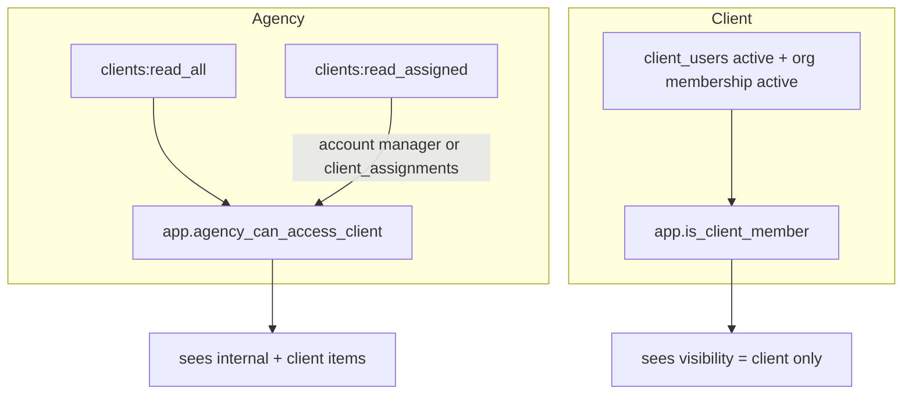

Write rights are separate permissions: agency `files:upload`, `files:manage`, `messages:send`, `client_users:manage`,
`packages:assign`; client `portal_files:upload`, `portal_messages:send`, `portal_users:manage`, `portal_company:update`.
A Client Viewer holds only `portal:access` + `portal_users:read`.

### Upload flow (ADR-020)

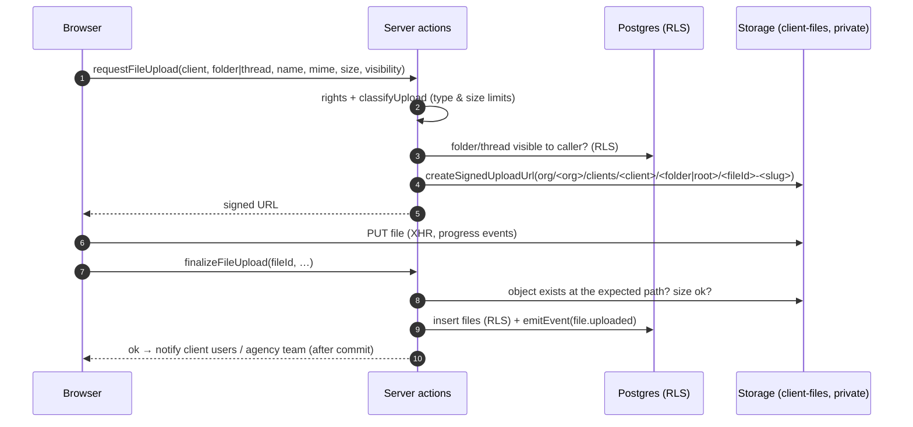

### Messaging

`threads` (polymorphic `subject_type/subject_id`, `visibility`) → `comments` (`visibility`, `mentions uuid[]`) →
`comment_attachments` (files with `source = 'attachment'`) and `thread_reads` (read receipts). The conversation view
subscribes to Realtime `comments` and `thread_reads` for its thread (after `ensureRealtimeAuth()`, ADR-024); RLS decides
which rows each subscriber receives, so internal notes never reach client sockets. After commit, `postComment` fans out
`message_new` / `mention` notifications (in-app + email per preferences) to the correct side with side-specific links.

### Package usage

`getPackageUsage(tx, clientPackageId)` → allowed per item (from `package_items`) vs used (sum of
`package_usage_entries`), plus period progress. Runs inside the caller's RLS transaction, so the same service powers
the agency client page and the portal home.

## 17. Phase 2 — requests

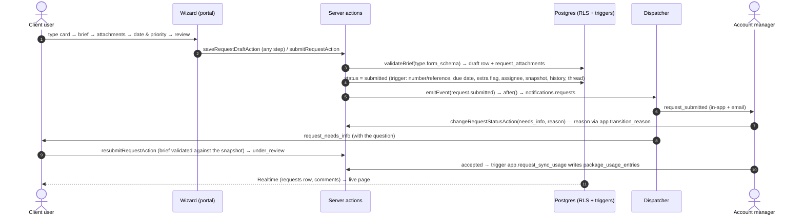

- Module: `src/modules/requests` — `form-schema.ts` (12 field types, `formSchemaSchema` for definitions, `validateBrief`
  for answers — the same validator in the wizard, the server and the resubmit path), `constants.ts` (statuses,
  `requestTransitions` per side mirrored by `app.request_transition_allowed`, SLA state, inbox views), `stats.ts`
  (client dashboard), `server/{queries,actions,consumers}.ts`, components (type builder, wizard, inbox + preview drawer,
  request detail, portal list, dashboard).
- Routes: agency `/requests`, `/requests/[id]`, `/admin/request-types`, `/admin/request-types/[id]`, client tab
  `/clients/[id]?tab=requests`; portal `/portal/requests`, `/portal/requests/new`, `/portal/requests/[id]`,
  `/portal/requests/[id]/edit` (drafts and needs-info). All behind `module.requests`; "Convert to tasks" behind `module.tasks`.
- Access: agency `requests:read` + client access; `requests:triage` (accept / needs info / reject, assign, priority,
  due date, extra/billable) or `requests:update` (work statuses of requests assigned to you); `request_types:manage`.
  Client `portal_requests:create` (Owner, Member); Viewers read only. Drafts are visible only to their author.

## 18. Phase 3 — tasks, deliverables & approvals

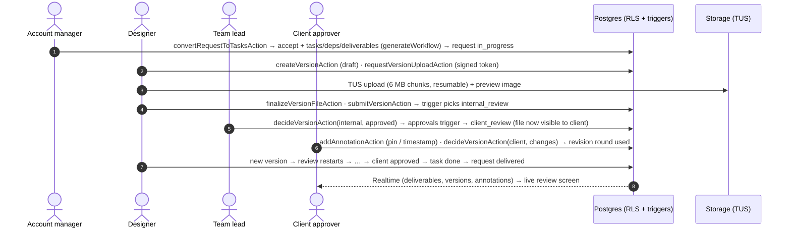

- Modules: `src/modules/workflows` (templates, steps, statuses, `generate.ts`, convert dialog, progress stepper),
  `src/modules/tasks` (queries/actions/consumers/reminders, board/list/table/calendar, drawer, My Work, `filter.ts`),
  `src/modules/deliverables` (queries/actions/consumers, review screen, viewers, resumable upload hook, approvals list,
  content calendar).
- Routes: agency `/tasks` (`?layout=board|list|table|calendar`, `?task=<id>` opens the drawer, `?view=<saved view>`),
  `/my-work`, `/deliverables`, `/deliverables/[id]`, `/admin/workflows`, `/admin/workflows/[id]`; the request page and
  the inbox preview drawer carry "Convert to tasks". Portal `/portal/approvals`, `/portal/approvals/[id]`,
  `/portal/calendar`, progress + deliverables on `/portal/requests/[id]`, approvals CTA on `/portal`.
- Access: `tasks:read/create/update/delete`, `workflows:manage`, `deliverables:manage`, `deliverables:review`,
  `time:read_all`; client decisions need `client_users.can_approve`. Flags: `module.tasks`, `module.approvals`,
  `module.calendar` (on by default).
- Board: dnd-kit (pointer, touch, keyboard with localized announcements; Left/Right jump columns), fractional
  `position`, optimistic cache updates rolled back on error, realtime refetch debounced (400 ms).
- Reminders: `runReminderSweep()` in `/api/cron/dispatch-events` emits `task.due_soon`, `task.overdue`,
  `deliverable.approval_reminder` once per marker (ADR-043).

## 19. Phase 4 — campaigns, metrics & reports

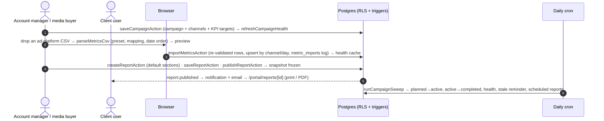

- Module: `src/modules/campaigns` — `constants.ts` (metric catalog: kind volume/cost/rate, format), `metrics.ts`
  (pure math: derived metrics, pacing, health, series), `csv.ts` (tolerant CSV parser + presets), `periods.ts`
  (schedule periods, default sections), `snapshot.ts` (rows, KPIs, report snapshots — not `server-only`, the seed
  uses it), `server/` (queries, actions, analysis/health cache, sweep, consumers), `components/` (list, form,
  overview, SVG charts, metrics grid, import dialog, report builder/view, schedules, portal views).
- Routes: agency `/campaigns`, `/campaigns/[id]` (`?tab=overview|metrics|creatives|reports`), `/reports`,
  `/reports/[id]`; portal `/portal/campaigns`, `/portal/campaigns/[id]`, `/portal/reports/[id]`, a campaigns block on
  `/portal`; a campaign picker on the agency request page.
- Access: `campaigns:read`, `campaigns:manage`, `metrics:manage`, `reports:manage`; clients see client-visible,
  non-draft campaigns and published reports (flag `module.campaigns`, on by default).
- Health: computed in TypeScript from the rows (`analyzeCampaign`), cached on `campaigns.health` through
  `app.campaign_store_health` (security definer; direct writes to the cache columns are ignored) — ADR-051.
- Reports: drafts render live numbers; publishing stores `reports.snapshot`; print CSS hides the shell and forces
  light tokens, so "Print / PDF" in the browser gives the branded PDF (ADR-049).
- Charts: plain SVG (`components/charts.tsx`) on `--chart-*` tokens validated for colour-vision deficiency in both
  modes (ADR-050).


## 20. Phase 5 — agency operations & SLA

```mermaid
sequenceDiagram
  autonumber
  actor Admin as Operations manager
  actor C as Client user
  actor AM as Account manager
  participant DB as Postgres (RLS + triggers)
  participant Cron as Daily cron
  Admin->>DB: savePolicyAction · saveBusinessHoursAction (app.set_business_hours) · saveHolidayAction
  C->>DB: submit request → requests_sla: app.sla_policy_for → response_due_at (business hours), due_date (working days)
  AM->>DB: needs info → sla_paused_at · client resubmits → due_date += working days waited (system event)
  Cron->>DB: runSlaSweep → sla_breaches (once per request × kind × level) → sla.at_risk / sla.breached
  DB-->>AM: notifications.sla consumer → assignee (+ account manager + escalation contact on breach)
  AM->>DB: acknowledgeBreachAction (note; who/when stamped by trigger)
```

- Modules: `src/modules/sla` — `calendar.ts` (working days, business hours; mirror of the SQL, parity-tested),
  `constants.ts` (policy matching, compliance), `server/` (queries: admin data, live issues `issuesOf`, monitor;
  actions; sweep; consumer), `components/` (admin, monitor). `src/modules/operations` — `health.ts` (client health
  score), `server/queries.ts` (ops overview, Client 360, clients health, team overview / member), `components/`.
- Routes: `/dashboard` (ops view with `operations:read`, `?scope=mine|<account manager id>`), `/sla`
  (`?days=90&view=unacknowledged|resolved|all&client=`), `/admin/sla`, `/team` (`?department=`), `/team/[userId]`;
  Client 360 is the overview tab of `/clients/[id]`; the clients list gains a health column.
- Live vs recorded: request screens, the monitor and the dashboard compute SLA states on read; the sweep only records
  breaches and alerts (ADR-055). The cron route runs reminders → campaigns → SLA → dispatcher.
- Scoping: every ops number comes from RLS-scoped queries (`withRls`), so views are limited to the clients the viewer
  can access; time totals follow `time:read_all` (ADR-056).

## 21. Phase 6 — CRM & capacity

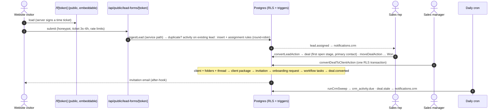

- Modules: `src/modules/crm` — `leads.ts` (phone/email normalisation, duplicates, merge, score, rule matching),
  `metrics.ts` (weighted value, stage conversion, win rate, cycle, forecast, sources, per owner), `quotes.ts` (totals,
  mirror of `app.quote_recalculate`), `server/` (`intake.ts` public form + webhook, `queries.ts`, `actions.ts`,
  `deal-actions.ts` files/quotes/conversion, `settings-actions.ts`, `dashboard.ts`, `sweep.ts`, `consumers.ts`),
  `components/`. `src/modules/capacity` — `calc.ts` (pure capacity maths, ADR-059), `server/queries.ts` (inputs via
  the `app.capacity_*` readers, ADR-060), `server/actions.ts` (hours, time off, service effort), `components/`.
- Routes: `/crm/leads`, `/crm/leads/[id]`, `/crm/pipeline` (`?pipeline=`), `/crm/deals/[id]`, `/crm/quotes/[id]`
  (print / PDF in the quote's language), `/crm/follow-ups` (`?scope=all` with `crm:manage_all`), `/crm/dashboard`
  (`?period=month|quarter|year&owner=&pipeline=`), `/capacity`, `/admin/crm`; public `/f/[token]`,
  `POST /api/public/lead-forms/[token]`, `POST /api/webhooks/leads`. The proxy treats `/f/`, `/api/public/` and
  `/api/webhooks/` as public; only `/f/` may be framed.
- Files: private `crm-files` bucket, `org/<org>/deals/<deal>/<file>-<name>`, signed upload after `app.can_write_deal`,
  signed download for rows the caller can select (same pattern as client files).
- The cron route now runs reminders → campaigns → SLA → CRM → dispatcher.

### Inbound lead webhook (contract for Phase 7 and third parties)

```http
POST /api/webhooks/leads
Authorization: Bearer ctw_…            (Sales settings → Integrations; shown once, stored hashed)
Content-Type: application/json

{
  "external_ref": "meta-lead-123456",  // required, unique per source — replays are ignored
  "source": "lead_ad",                 // website_form | whatsapp | instagram | referral | event | lead_ad | manual | other (default lead_ad)
  "source_detail": "Meta · Ramadan",   // optional, free text
  "full_name": "Sara Al-Otaibi",       // required
  "company": "Qahwa Lab",              // optional
  "phone": "0551234567",               // phone or email required; Saudi formats normalised to E.164
  "email": "sara@example.com",
  "city": "riyadh",                    // optional: riyadh | jeddah | dammam | khobar | makkah | madinah | abha | taif | tabuk | qassim | other
  "services": ["social_media", "ads"], // optional: social_media | content | design | video | photography | ads | branding | web | influencers
  "budget_range": "15k_50k",           // optional: under_5k | 5k_15k | 15k_50k | 50k_plus | unknown
  "message": "…"                       // optional, stored in the lead notes
}
```

| Response | Meaning |
|---|---|
| `201 {"leadId", "duplicate": false}` | New lead, assigned by the rules |
| `200 {"leadId", "duplicate": true}` | Same `external_ref` again, or an existing lead with that phone/email (the submission is added to it as an activity) |
| `400 {"error": "validation", "fieldErrors"}` | Invalid body |
| `401` / `429` | Missing, unknown or revoked token / more than 120 requests per minute per token |


## 22. Phase 7 — integrations & automation

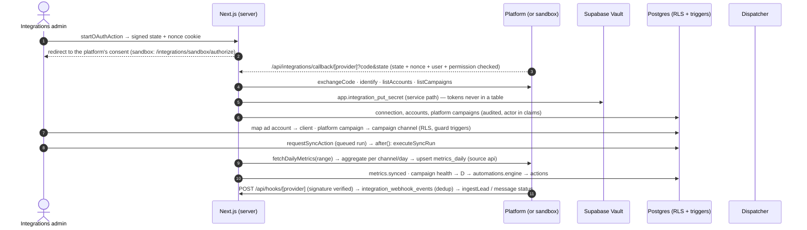

- Modules: `src/modules/integrations` — `constants.ts` (providers, health, errors, sync limits), `providers/` (`types.ts`
  interface + `ProviderError`, `http.ts`, `meta.ts`, `whatsapp.ts`, `tiktok.ts`, `snapchat.ts`, `google.ts`, `sandbox.ts`,
  `index.ts` registry / env checks), `signatures.ts` (webhook signatures, OAuth state — pure), `metrics.ts` (aggregation —
  pure), `webhook-parsers.ts` (payload → items — pure), `server/` (`connections.ts` Vault + discovery + health,
  `sync.ts`, `webhooks.ts`, `whatsapp.ts`, `sweep.ts`, `consumers.ts`, `queries.ts`, `actions.ts`), `components/`.
  `src/modules/automations` — `constants.ts` (trigger catalog with fields, operators, action applicability, limits),
  `schemas.ts`, `engine-core.ts` (conditions, templating, loop guard, URL guard — pure), `server/engine.ts` (context
  loader, actions, runs, the `automations.engine` consumer), `server/queries.ts`, `server/actions.ts`, `components/`.
- Routes: `/admin/integrations`, `/admin/integrations/[connectionId]` (accounts, campaigns, sync, templates, messages,
  webhooks), `/admin/automations`, `/admin/automations/new`, `/admin/automations/[id]` (`?tab=rule|test|runs`),
  `/integrations/sandbox/authorize`; API `GET|POST /api/hooks/[provider]` (public, signature-checked; GET answers the
  Meta verify challenge), `GET /api/integrations/callback/[provider]`. WhatsApp panel on `/crm/leads/[id]` and
  `/crm/deals/[id]`; WhatsApp opt-in and channel column on `/settings/notifications`.
- Service paths (ADR-067): Vault reads, provider calls and their bookkeeping, webhook processing and WhatsApp sends run
  with the service connection **after** an RLS-checked lookup or permission probe in the action; guard triggers keep
  status / health / external ids server-owned even for managers (`app.is_user_write()` reads the `role` setting).
- Events: `integration.*`, `metrics.synced`, `whatsapp.*`, `automation.*`; `domain_events.automation_depth` /
  `automation_chain` are set by `emitEvent` from `automationCause` (AsyncLocalStorage) while a rule's actions run.
- Consumers: `notifications.integrations` (expired connection, final sync failure, failed rule, failed lead message) and
  `automations.engine` (every trigger in the catalog). `notify()` adds the WhatsApp channel (opt-in + per-category switch).
- Cron: reminders → campaigns → SLA → CRM → **integrations** (token refresh / expiry, daily sync scheduling, due runs
  and retries, stuck webhook events, one WhatsApp retry) → dispatcher. On the Hobby plan this is once a day; "Sync now"
  and backfills run immediately after the request.
- Environment: `INTEGRATIONS_SANDBOX`, `INTEGRATIONS_SIGNING_SECRET`, `META_APP_ID`, `META_APP_SECRET`,
  `META_WEBHOOK_VERIFY_TOKEN`, `META_GRAPH_VERSION`, `TIKTOK_APP_ID`, `TIKTOK_APP_SECRET`, `SNAPCHAT_CLIENT_ID`,
  `SNAPCHAT_CLIENT_SECRET`, `SNAPCHAT_WEBHOOK_SECRET`, `GOOGLE_CLIENT_ID`, `GOOGLE_CLIENT_SECRET`,
  `GOOGLE_ADS_DEVELOPER_TOKEN`, `GOOGLE_ADS_LOGIN_CUSTOMER_ID`, `GOOGLE_ADS_API_VERSION`, `GOOGLE_LEAD_WEBHOOK_KEY`
  (see `.env.example`). OAuth redirect URI per platform: `<APP_URL>/api/integrations/callback/<provider>`.

### Outbound automation webhook (contract)

```http
POST <your https URL>
Content-Type: application/json
X-Central-Event: lead.created
X-Central-Delivery: <run id>            (stable across retries)
X-Central-Signature: t=<unix seconds>,v1=<hex HMAC-SHA256(key, "<t>.<raw body>")>

{ "automation": { "id", "name" }, "event": { "id", "type", "occurredAt", "payload" },
  "subject": { "type": "lead", "id" }, "data": { "lead.full_name": "…", "lead.source": "lead_ad", … } }
```

The key is shown to `automations:manage` in the builder; any 2xx is success, anything else is retried (ADR-071).
