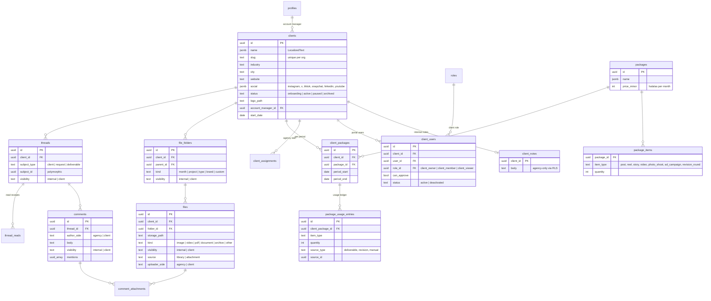
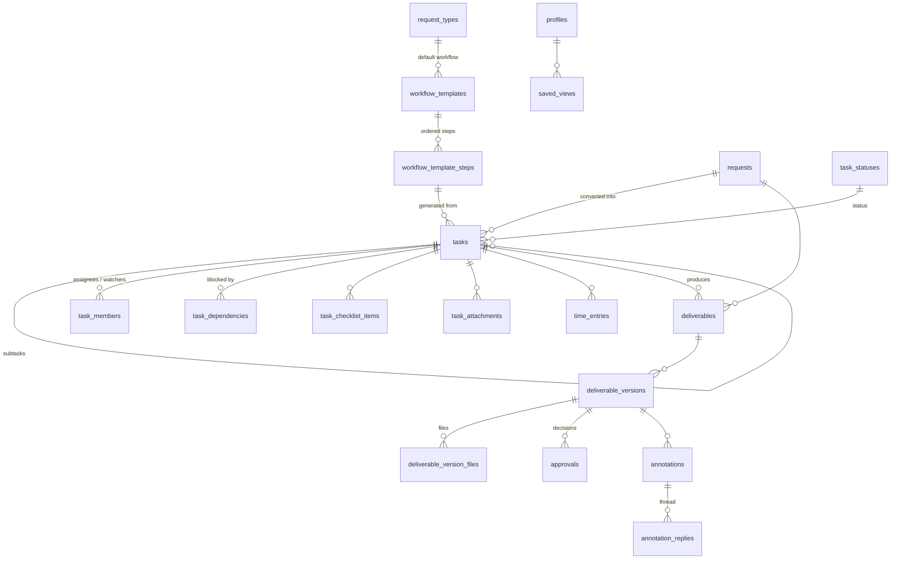
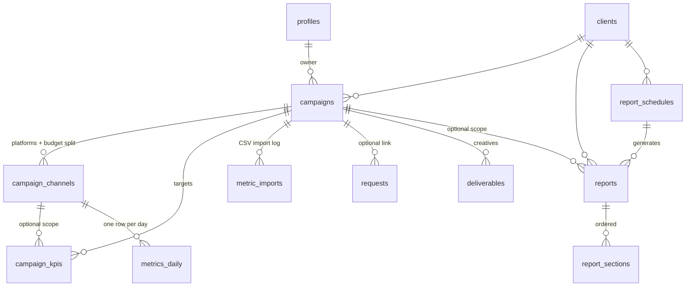
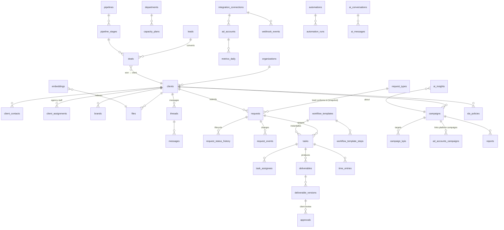

# Data Model

Status: **Phases 0–2**. Conventions from `CLAUDE.md §6`: plural `snake_case` tables, `uuid` PKs,
`timestamptz` UTC, `organization_id` on tenant-scoped tables, `LocalizedText = jsonb {ar, en}`,
`created_at` / `updated_at` on every mutable table (`updated_at` maintained by trigger).

## 1. Phase 0 ERD

Supporting (not in diagram): `rate_limits (key, window_start, count)` — used by auth rate limiting;
`domain_event_deliveries (event_id, consumer, processed_at, attempts, last_error)` — created in Phase 0, used from Phase 1.

### Key constraints & indexes

- `organization_members`: unique `(organization_id, user_id)`; check `user_type='client' ⇔ client_id is not null`.
- `roles`: unique `(organization_id, key)`; `user_roles`: unique `(user_id, role_id, coalesce(client_id, nil))`;
  trigger ensures `role.side` matches member `user_type`, and client roles carry the member's `client_id`.
- `invitations`: partial unique `(organization_id, lower(email)) where status = 'pending'`.
- `department_members`: only `agency` members (trigger check).
- `activity_log`, `domain_events`: append-only (no update/delete policies; revoke `update, delete` from `authenticated`).
  Index `(organization_id, created_at desc)`, `(table_name, record_id)`, `(type, occurred_at)`.
- `notifications`: index `(user_id, read_at nulls first, created_at desc)`; added to `supabase_realtime` publication.
- All FK columns indexed (RLS joins rely on them).

### Audited tables (generic `app.audit_trigger`)

`organizations`, `organization_members`, `profiles`, `clients`, `roles`, `role_permissions`, `user_roles`,
`user_permission_overrides`, `departments`, `department_members`, `invitations` (token_hash redacted),
`organization_features`. Excluded: high-volume/self-describing tables (`notifications`, `domain_events`, `activity_log`).

## 2. Seeded reference data

### Permission catalog (Phase 0)

| Resource | Actions | Side |
|---|---|---|
| `organization` | `read`, `update` | agency |
| `users` | `read`, `invite`, `update`, `deactivate` | agency |
| `invitations` | `read`, `create`, `resend`, `revoke` | agency |
| `roles` | `read`, `create`, `update`, `delete`, `assign` | agency |
| `permissions` | `override` | agency |
| `departments` | `read`, `manage` | agency |
| `clients` | `read_all`, `read_assigned`, `manage` | agency |
| `feature_flags` | `manage` | agency |
| `audit_log` | `read` | agency |
| `design_system` | `view` | agency |
| `portal` | `access` | client |
| `client_users` | `read`, `invite`, `manage` | client |

Later phases append to the catalog (e.g. `requests:create`, `tasks:assign`, `campaigns:read`, `leads:manage`).

### System roles & default grants

| Role (key) | Side | Default permissions |
|---|---|---|
| Super Admin (`super_admin`) | agency | **all** (locked) |
| Admin / Operations Manager (`admin`) | agency | all agency permissions except `feature_flags:manage` |
| Account Manager (`account_manager`) | agency | `users:read`, `departments:read`, `clients:read_assigned`, `invitations:read/create/resend/revoke` (client invites only — enforced by RLS on `user_type`), `design_system:view` |
| Team Lead (`team_lead`) | agency | `users:read`, `departments:read`, `clients:read_all`, `design_system:view` |
| Specialist (`specialist`) | agency | `users:read`, `departments:read`, `clients:read_assigned` |
| Client Owner (`client_owner`) | client | `portal:access`, `client_users:read/invite/manage` |
| Client Member (`client_member`) | client | `portal:access`, `client_users:read` |
| Client Viewer (`client_viewer`) | client | `portal:access` |

Everyone can always read/update **their own** profile and notification preferences (not permission-gated).

### Departments

Design (`design`), Video (`video`), Content (`content`), Media Buying (`media_buying`), Account Management (`account_management`).

### Dev seed (`pnpm db:reset`)

1 organization ("Demo Agency" / "وكالة تجريبية"), 10 agency users spread across departments with every
agency role represented, 1 demo client with 3 client users (Owner, Member, Viewer), a few pending/expired
invitations, sample notifications. All seed users: password `Passw0rd!` (local only), emails `@demo.local`.

## 3. RLS strategy

**Principles**

1. `alter table … enable row level security` on every table, **including** reference tables (`permissions`,
   `feature_flags` → `select` for `authenticated`, no writes).
2. Policies are written per command (`select`, `insert`, `update`, `delete`), never `for all`, so each can be
   tested and reasoned about separately.
3. Policies only call `app.*` helper functions (security definer, `search_path=''`), wrapped in `(select …)`
   so Postgres evaluates them once per statement.
4. Tenant isolation first: every policy on a tenant table includes `app.is_org_member(organization_id)`
   (implied by `has_permission`, which checks membership).
5. Side isolation: agency-only tables additionally require `app.is_agency_member(organization_id)`.
6. `anon` gets nothing, except the invitation lookup RPC (`app.get_invitation_preview(token)`, returns minimal
   fields: org name, email masked, status) — no direct table access.
7. Append-only tables: `insert` via helper/trigger only; no `update`/`delete` for anyone but `service_role`.

**Representative policies**

| Table | select | insert / update / delete |
|---|---|---|
| `profiles` | self; or agency member of a shared org with `users:read`; client users see profiles of members of the same client + their assigned agency contacts (Phase 1) | update self only (and `users:update` for admin fields via RPC) |
| `organization_members` | self row; `users:read` (agency); `client_users:read` scoped to same `client_id` | via RPC/actions: `users:update`, `users:deactivate`; client side `client_users:manage` on same client, never agency rows |
| `roles`, `role_permissions` | `roles:read` (agency); client users can read client-side roles (for their team page) | `roles:create/update/delete`; locked role rows immutable (trigger + policy) |
| `user_roles` | self; `roles:read` | `roles:assign`; client owners may assign client roles within own client; nobody can grant a role containing permissions they don't hold (anti-escalation trigger) |
| `user_permission_overrides` | self; `roles:read` | `permissions:override` (anti-escalation applies) |
| `departments`, `department_members` | agency members | `departments:manage` |
| `invitations` | `invitations:read` (agency); client owners see their client's invites | `invitations:create/resend/revoke`; client owners only for `user_type='client'` + own `client_id`; account managers only for client invites |
| `clients` | `clients:read_all`, or `read_assigned` + assignment (Phase 1 table), or client member of that client | `clients:manage` |
| `organization_features` | org members (read — the UI needs flags) | `feature_flags:manage` |
| `domain_events` | none for users (service/consumers only) | insert via `app.emit_event()` security definer |
| `activity_log` | `audit_log:read` | trigger only |
| `notifications` | `user_id = auth.uid()` | update self (`read_at` only, column-level grant); insert via `app.notify()` |
| `notification_preferences` | self | self |

**Anti privilege-escalation**: a user may only grant (via role edit, role assignment, override, or invitation)
permissions that they themselves hold; Super Admin is exempt. Enforced by a trigger calling
`app.assert_can_grant(permission_keys)` so it holds even for direct API calls.

**Testing** (`tests/db`): for each table, as each seeded persona (super admin, admin, account manager, specialist,
client owner, client viewer, other-org user, anon) assert allowed and denied `select/insert/update/delete`.
Plus a meta-test: every table in `public`/`app` schemas has RLS enabled and ≥ 1 policy.

## 3b. Phase 1 — client portal entities

**Client roles live on `client_users.role_id`** (ADR-018): a client user's role is scoped to one client, and a person
could belong to several clients with different roles. `user_roles` stays agency-only.

**Package usage** is a ledger (`package_usage_entries`) rather than counters: Phase 3 deliverables and revision rounds
append rows with `source_type/source_id`, and `getPackageUsage()` sums them per item type for the current period.

**Visibility rules** (enforced by RLS, not only by queries):

| Item | Agency staff with access to the client | Client users of that client |
|---|---|---|
| `files` / `file_folders` with `visibility = 'client'` | ✅ | ✅ (not soft-deleted; parent folder also client-visible) |
| `files` / `file_folders` with `visibility = 'internal'` | ✅ | ❌ |
| `threads` with `visibility = 'internal'` | ✅ | ❌ |
| `comments` with `visibility = 'internal'` (internal notes inside a client thread) | ✅ | ❌ |
| `client_notes` | ✅ | ❌ |
| Writing files / messages | `files:upload`, `messages:send` | `portal_files:upload`, `portal_messages:send` (Viewer has neither) |

Triggers force every client-scoped row to carry its client's `organization_id`, and force comments in an internal
thread to be internal, so a crafted request can't leak data across tenants or visibility levels.

## 3c. Phase 2 — requests (revision 2)

**Form schema.** `request_types.form_schema.fields` is an ordered array of
`{ id, type, label: LocalizedText, help?, required, options?, min?, max?, maxLength?, maxItems?, showIf? }` with
`type ∈ short_text | long_text | number | single_select | multi_select | date | file | links | platforms | dimensions |
color | checkbox`. `showIf = { field, equals }` shows a field only when an **earlier** field has that value (select /
checkbox / platforms); hidden fields are never required and are dropped from the saved brief. `validateBrief()` is the
single validator (portal wizard, server actions, builder preview); `draft` mode skips "required". Editing a type bumps
`schema_version`; each request stores `form_snapshot`, so old briefs always render with the questions they answered.

**Lifecycle** (`requestTransitions` in TS ≡ `app.request_transition_allowed(from, to, side)` in SQL):

| From | Client may move to | Agency may move to |
|---|---|---|
| `draft` | `submitted` (drafts are deleted, not cancelled) | — (agency never sees drafts) |
| `submitted` | `cancelled` | `under_review`, `needs_info`*, `accepted`, `rejected`* |
| `under_review` | `cancelled` | `needs_info`*, `accepted`, `rejected`* |
| `needs_info` | `under_review` (resubmit after editing), `cancelled` | `under_review` |
| `accepted` | — | `in_progress` |
| `in_progress` | — | `in_review`, `delivered` |
| `in_review` | — | `in_progress`, `delivered` |
| `delivered` | `closed` | `closed`, `in_progress` (rework) |
| `rejected` | — | `under_review` (reopen) |
| `closed`, `cancelled` | — | — |

\* reason required (enforced by the history trigger). Accept / reject / needs-info / priority / due date / assignee /
flags need `requests:triage`; the assignee with `requests:update` may move accepted work through in progress → delivered.

**Triggers.** On submit: per-client `number` + `reference` (`clients.request_prefix`, advisory lock), `submitted_at`,
`due_date` = submit date + `sla_days` working days (Fri/Sat skipped, org time zone), `is_extra` from the package quota
(`app.request_quota`), thread creation. Client users may change `title / brief / reference_links / desired_date /
priority (low–high)` only in `draft` or `needs_info`; everything else is server-owned. Every status change writes
`request_status_history`; assignment/priority/due date/flags write internal `request_events`, brief edits a client-visible one.
**Package consumption:** entering `accepted` inserts one `package_usage_entries` row (`source_type = 'request'`) into the
client package covering today when the type counts against an item the package includes and the request isn't extra;
`rejected` / `cancelled` or marking it extra removes it (idempotent, one row per request).

**RLS**

| Table | Agency | Client users of that client |
|---|---|---|
| `request_types` | read: members; write: `request_types:manage` | read active types |
| `requests` | read `requests:read` + client access, never drafts; update: `requests:triage`, or `requests:update` when assignee | read non-drafts + own drafts; insert/update: `portal_requests:create` (Viewer read-only); delete own drafts |
| `request_status_history` | read with the request | read with the request |
| `request_events` | read with the request | `visibility = 'client'` only |
| `request_attachments` | read with the request; insert by the file's uploader | same |

Internal notes are internal comments in the request thread (existing messaging RLS).

## 3d. Phase 3 — tasks, workflows, deliverables & approvals

| Table | Key columns | Notes |
|---|---|---|
| `task_statuses` | `key`, `name` (AR/EN), `category` (`todo · active · review · changes · done · blocked`), `color`, `sort_order`, `is_default` | Per organization, editable. Logic keys off the **category**, never the name. Seeded: To do, In progress, In review, Changes requested, Done, Blocked. |
| `workflow_templates` | `request_type_id?`, `name`, `description`, `is_active`, `is_default` | One default template per request type (partial unique index). |
| `workflow_template_steps` | `template_id`, `name`, `department_id?`, `assignee_mode` (`account_manager · role · user · none`), `assignee_role_id?`, `assignee_user_id?`, `sla_days`, `depends_on uuid[]` (step ids), `requires_internal_review`, `requires_client_approval`, `deliverable_type?`, `sort_order` | Dependencies must point to steps of the same template (trigger, no cycles). |
| `tasks` | `client_id` (required), `request_id?`, `parent_id?` (one level of subtasks), `workflow_step_id?`, `number` (per org, shown `T-123`), `title`, `description` (Markdown), `department_id?`, `status_id` + denormalized `status_category`, `priority`, `start_date`, `due_date`, `estimate_minutes`, `tags text[]`, `reviewer_id?`, `position` (board order), `requires_internal_review`, `requires_client_approval`, `completed_at`, reminder markers | Agency-only. Status category maintained by trigger; `completed_at` set/cleared with `done`. |
| `task_members` | `task_id`, `user_id`, `role` (`assignee · watcher`) | Active agency members only (trigger). |
| `task_dependencies` | `task_id`, `depends_on_id` | Same client, no self/cycles (trigger). A task whose blockers are all done is *unblocked* → event. |
| `task_checklist_items` | `task_id`, `body`, `is_done`, `sort_order`, `done_by`, `done_at` | |
| `task_attachments` | `task_id`, `file_id` | Files with `source = 'attachment'`, `visibility = 'internal'`. |
| `time_entries` | `task_id`, `user_id`, `started_at`, `ended_at?`, `minutes`, `note`, `source` (`timer · manual`) | Internal only. One running timer per user (partial unique index). Users write only their own. |
| `saved_views` | `owner_id`, `is_shared`, `name`, `layout` (`board · list · table · calendar`), `config jsonb` (filters, grouping, swimlanes, sort) | Personal or shared with the agency. |
| `deliverables` | `client_id`, `request_id?`, `task_id?`, `type` (`design · video · copy · document · other`), `title`, `status`, `requires_internal_review`, `requires_client_approval`, `current_version_id`, `version_count`, `revision_rounds`, `scheduled_for?`, `approved_at`, `client_visible_at`, `reminded_at` | Status: `in_progress → internal_review ⇄ internal_changes → client_review ⇄ client_changes → approved`; stages skipped when not required. |
| `deliverable_versions` | `deliverable_id`, `number`, `notes`, `status`, `uploaded_by`, `submitted_at`, `sent_to_client_at`, `decided_at` | A new version restarts review; undecided older versions become `superseded`, decided ones keep their decision. |
| `deliverable_version_files` | `version_id`, `file_id`, `sort_order` | Files with `source = 'deliverable'` (+ `thumbnail_path`, `width`, `height`, `duration_seconds` on `files`). |
| `approvals` | `deliverable_id`, `version_id`, `stage` (`internal · client`), `decision` (`approved · changes_requested`), `reviewer_id`, `comment` | Insert-only. A trigger validates the stage against the version status, requires a comment for changes, and advances version → deliverable → task (→ request `delivered`). |
| `annotations` | `version_id`, `file_id?`, `kind` (`point · timestamp · general`), `x`, `y` (0–1), `time_seconds`, `body`, `visibility` (`internal · client`), `author_side`, `resolved_at`, `resolved_by` | Each annotation is a thread (`annotation_replies`), resolvable. |
| `annotation_replies` | `annotation_id`, `author_id`, `author_side`, `body` | Inherits the annotation's visibility. |

Changes to existing tables: `threads.subject_type` gains `task` (internal task comments), `files.source` gains
`deliverable`, `requests` gains `workflow_template_id` and `converted_at`.

**Lifecycle rules (triggers)**
- *Convert to tasks* (action, one transaction): accept the request if needed → one task per template step with
  dependencies, assignee (account manager / first client-team member with the role / a fixed user), reviewer
  (client account manager), due dates computed step by step (start = latest due date of its blockers, due = start +
  `sla_days` working days) and a deliverable for steps that produce one → request `in_progress`. Idempotent
  (`converted_at`).
- *Review*: submitting a version moves it to `internal_review` (or straight to `client_review` when the step needs no
  internal review) and the task to its `review` status. Internal approval sends it to the client if required, else
  approves. Changes requested (internal or client) → task back to `changes` with the feedback; a new version restarts
  the review.
- *Revision rounds*: every client "changes requested" writes one `package_usage_entries` row
  (`item_type = 'revision_round'`, `source_type = 'approval'`); the portal warns when the package allowance is used up.
- *Delivered*: when every deliverable of a request is approved, the request moves to `delivered`.

**RLS**

| Table | Agency | Client users of that client |
|---|---|---|
| `task_statuses`, `workflow_*` | read: agency members; write: `workflows:manage` | — |
| `tasks` and task child tables | read `tasks:read` + client access; write `tasks:create/update/delete` | — (never) |
| `time_entries` | own entries; everyone's with `time:read_all` | — |
| `saved_views` | own + shared | — |
| `deliverables` | read with `tasks:read` + client access; write `deliverables:manage` | only once sent for client approval (`client_visible_at`) |
| `deliverable_versions` / `_files` | same | only versions sent to the client |
| `files` (`source = 'deliverable'`) | client access | only files of versions sent to the client |
| `approvals` | all stages; insert internal with `deliverables:review` | `stage = 'client'` only; insert when `can_approve` and the version awaits them |
| `annotations` / replies | all | `visibility = 'client'` only; insert on versions they can see |

Portal progress on the request page comes from `app.request_progress(request_id)` (security definer): step names and
state only — never internal tasks, assignees or comments.

## 3e. Phase 4 — campaigns, metrics & reports

| Table | Key columns | Notes |
|---|---|---|
| `campaigns` | `client_id`, `number` (per org, shown `C-12`), `name`, `objective` (`awareness · traffic · engagement · leads · sales · app_installs · video_views`), `status` (`draft · planned · active · paused · completed · archived`), `start_date`, `end_date`, `budget_minor` + `currency`, `owner_id`, `description`, `visibility` (`internal · client`), `health` (`on_track · at_risk · off_track · no_data`), `health_notified`, `metrics_through` | Drafts never reach the portal (RLS: clients only see `planned · active · paused · completed`). `health` is cached by `refreshCampaignHealth()` after metric/KPI writes and by the daily sweep (ADR-051). |
| `campaign_channels` | `campaign_id`, `platform` (`meta · instagram · facebook · tiktok · snapchat · google · youtube · x · linkedin · other`), `name`, `budget_minor`, `external_ref` (platform campaign id — Phase 7 sync), `sort_order` | |
| `campaign_kpis` | `campaign_id`, `channel_id?` (null = whole campaign), `metric` (catalog key), `target` numeric, `sort_order` | Direction comes from the metric catalog (volume ↑, cost ↓). Unique per (campaign, channel, metric). |
| `metrics_daily` | `campaign_id`, `channel_id`, `client_id`, `date`, `impressions`, `reach`, `clicks`, `spend_minor`, `conversions`, `leads`, `video_views`, `engagements`, `revenue_minor`, `source` (`manual · import · api`), `import_id?`, `updated_by` | Unique (channel, date) → imports upsert. Not partitioned (ADR-048). Derived metrics (CTR, CPC, CPM, CPA, CPL, ROAS, frequency, engagement rate) are computed, never stored. |
| `metric_imports` | `campaign_id`, `channel_id`, `file_name`, `preset` (`meta · tiktok · snapchat · google · custom`), `row_count`, `date_from`, `date_to`, `imported_by` | Audit trail of CSV imports. |
| `reports` | `client_id`, `campaign_id?`, `schedule_id?`, `title`, `period_start`, `period_end`, `locale`, `status` (`draft · published`), `snapshot jsonb`, `published_at`, `published_by` | Drafts compute numbers live; publishing freezes them into `snapshot` so the client always sees what was published (ADR-049). |
| `report_sections` | `report_id`, `kind` (`kpi_summary · trend · channel_breakdown · top_creatives · commentary · next_steps`), `config jsonb` (metrics, grain), `body` (Markdown, commentary/next steps), `sort_order` | Read-only once the report is published. |
| `report_schedules` | `client_id`, `campaign_id?`, `cadence` (`weekly · monthly`), `sections` (template), `auto_publish`, `next_run_on`, `last_run_at`, `is_active` | The daily sweep creates the report for the period that just ended. |

Changes to existing tables: `requests.campaign_id` and `deliverables.campaign_id` (nullable, same client — trigger).

**Pacing & health** (pure functions in `src/modules/campaigns/metrics.ts`, mirrored nowhere else)
- Elapsed share of the flight `e = days elapsed / flight days` (clamped 0–1; uses the last day with metrics).
- Volume KPI (impressions, clicks, leads…): projected = actual ÷ e; ratio = projected ÷ target.
  Cost KPI (CPC, CPA, CPL, CPM): ratio = target ÷ actual. Rate KPI (CTR, ROAS, engagement rate): ratio = actual ÷ target.
- ratio ≥ 1 → on track, ≥ 0.85 → at risk, below → off track. Budget pacing uses spend ÷ (budget × e): > 1.15 or < 0.85 → at risk.
- Campaign health = the worst of its KPIs and budget pacing; `no_data` before the first metrics.

**RLS**

| Table | Agency | Client users of that client |
|---|---|---|
| `campaigns`, `campaign_channels`, `campaign_kpis` | read `campaigns:read` + client access; write `campaigns:manage` | read when the campaign is `visibility = 'client'` and not `draft`/`archived` (flag `module.campaigns`) |
| `metrics_daily` | read `campaigns:read`; write `metrics:manage` | read for campaigns they can see |
| `metric_imports` | read `campaigns:read`; insert `metrics:manage` | — |
| `reports`, `report_sections` | read `campaigns:read`; write `reports:manage` (published reports only unpublish → draft) | `status = 'published'` only |
| `report_schedules` | read `campaigns:read`; write `reports:manage` | — |

## 4. Forward-looking sketch (all phases — not built in Phase 0)

| Phase | Main entities | Notes |
|---|---|---|
| 1 Portal | `clients` (extended), `client_assignments`, `brands`, `files`, `folders`, `threads`, `messages`, `thread_participants` | Storage bucket per org, path `org/<org>/client/<client>/…`; Realtime for messages |
| 2 Requests | **Built** — see §3c | Form definition versioned so old requests render correctly |
| 3 Tasks | `workflow_templates`, `workflow_template_steps`, `tasks`, `task_assignees`, `task_dependencies`, `deliverables`, `deliverable_versions`, `approvals`, `comments`, `time_entries` | Status machines per template; approvals by client users |
| 4 Campaigns | **Built** — see §3e | Metrics not partitioned (ADR-048); published reports are snapshots |
| 5 Ops | `sla_policies`, `sla_breaches`, read models/views for Client 360 & dashboard | Mostly views over earlier phases |
| 6 CRM | `leads`, `pipelines`, `pipeline_stages`, `deals`, `deal_activities`, `capacity_plans`, `availability` | Won deal → creates client |
| 7 Integrations | `integration_connections` (tokens in Supabase Vault), `ad_accounts`, `social_accounts`, `webhook_events`, `sync_jobs`, `automations`, `automation_runs`, `whatsapp_templates` | Automation triggers = `domain_events` types |
| 8 AI | `ai_insights`, `ai_recommendations`, `ai_conversations`, `ai_messages`, `embeddings` (pgvector) | Every AI output linked to source records for traceability |
