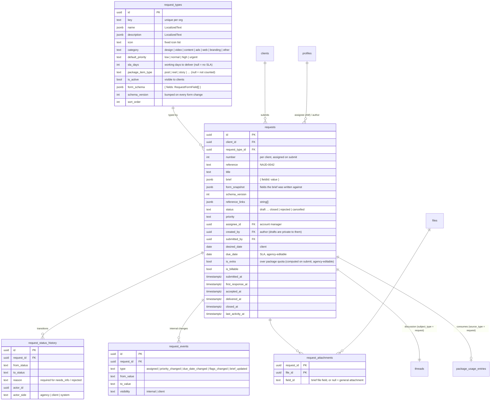
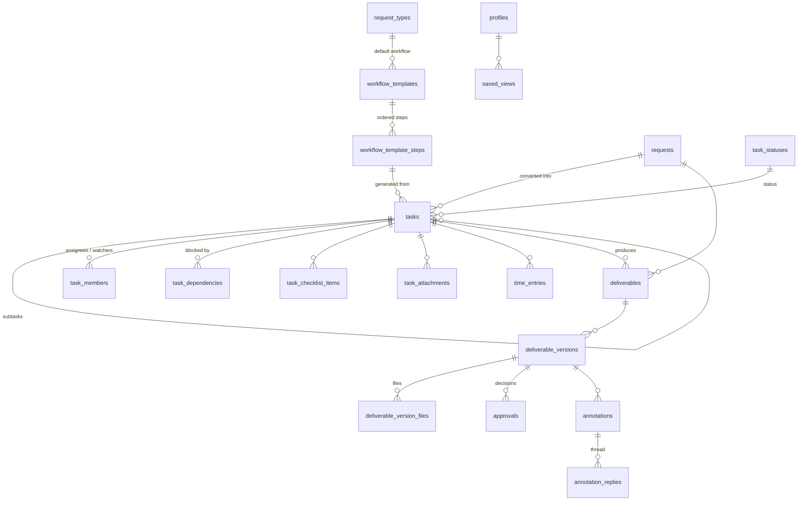
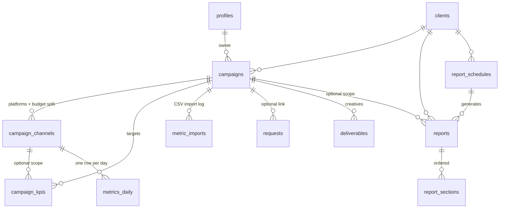
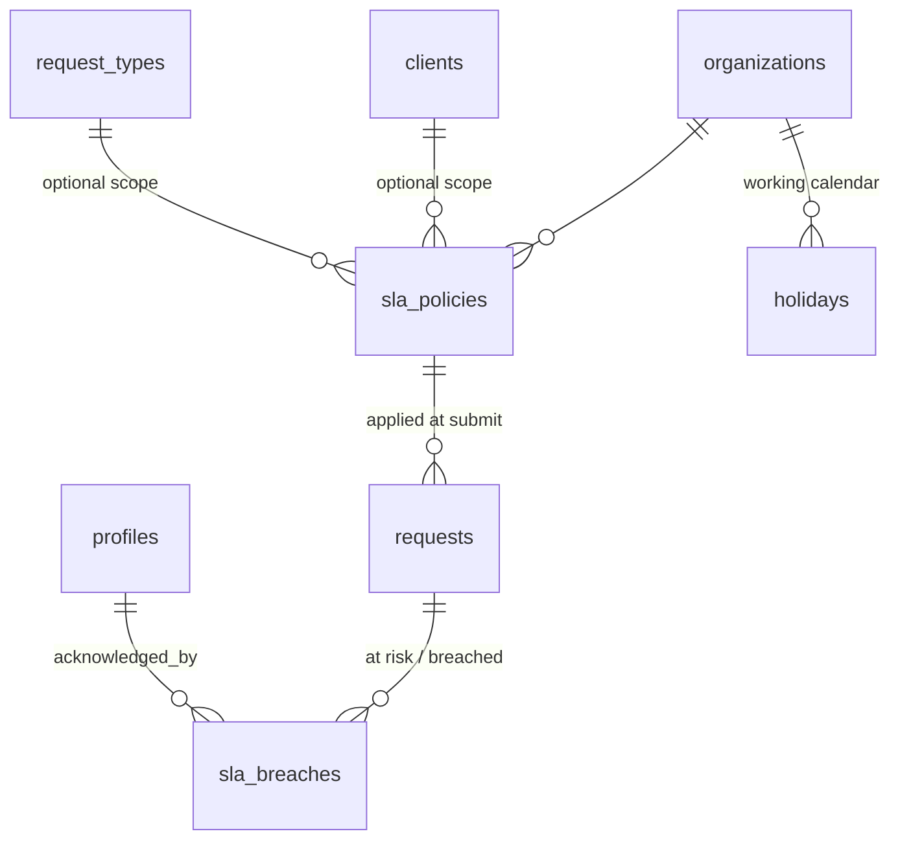
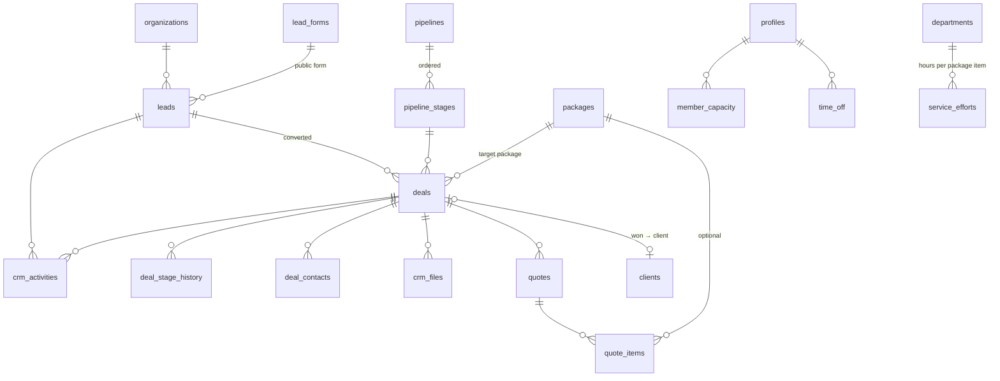
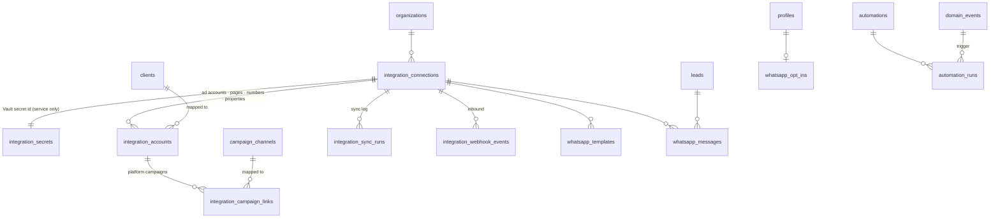
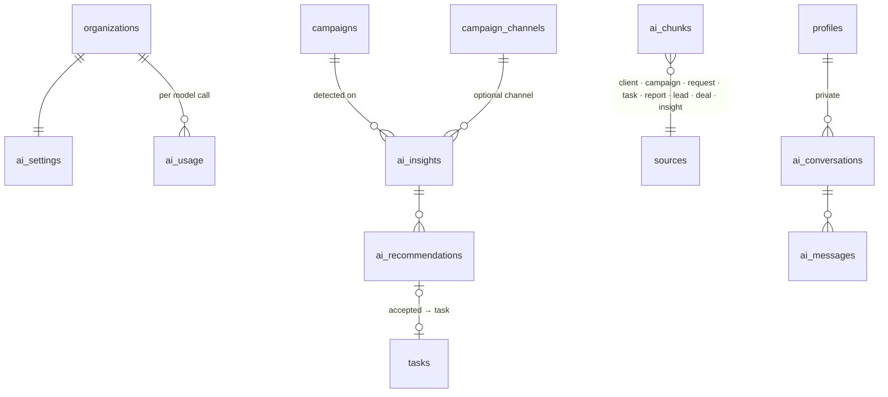
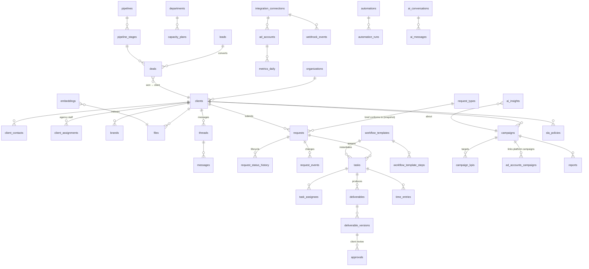

# Data Model

Status: **Phases 0–2**. Conventions from `CLAUDE.md §6`: plural `snake_case` tables, `uuid` PKs,
`timestamptz` UTC, `organization_id` on tenant-scoped tables, `LocalizedText = jsonb {ar, en}`,
`created_at` / `updated_at` on every mutable table (`updated_at` maintained by trigger).

## 1. Phase 0 ERD

```mermaid
erDiagram
  organizations ||--o{ organization_members : has
  organizations ||--o{ clients : serves
  organizations ||--o{ roles : defines
  organizations ||--o{ departments : has
  organizations ||--o{ invitations : issues
  organizations ||--o{ organization_features : configures
  organizations ||--o{ domain_events : records
  organizations ||--o{ activity_log : records
  organizations ||--o{ notifications : scopes

  auth_users ||--|| profiles : "1:1"
  profiles ||--o{ organization_members : "member of"
  clients ||--o{ organization_members : "client users"

  roles ||--o{ role_permissions : grants
  permissions ||--o{ role_permissions : "granted by"
  roles ||--o{ user_roles : "assigned via"
  profiles ||--o{ user_roles : holds
  clients |o--o{ user_roles : "client-scoped"
  permissions ||--o{ user_permission_overrides : ""
  profiles ||--o{ user_permission_overrides : ""

  departments ||--o{ department_members : ""
  profiles ||--o{ department_members : ""

  invitations }o--o{ roles : "pre-assigns (role_ids)"

  feature_flags ||--o{ organization_features : ""

  profiles ||--o{ notifications : receives
  profiles ||--o{ notification_preferences : sets

  organizations {
    uuid id PK
    text slug UK
    jsonb name "LocalizedText"
    text default_locale "ar"
    text default_timezone "Asia/Riyadh"
    char3 default_currency "SAR"
    text logo_path
    jsonb settings
  }
  profiles {
    uuid id PK "= auth.users.id"
    text full_name
    text email "mirror of auth email"
    text phone "E.164"
    text avatar_path
    text locale "ar | en"
    text theme "system | light | dark"
    text timezone
    text calendar "gregory | islamic-umalqura"
    timestamptz onboarded_at
  }
  organization_members {
    uuid id PK
    uuid organization_id FK
    uuid user_id FK
    text user_type "agency | client"
    uuid client_id FK "required when client"
    text job_title
    text status "active | deactivated"
    uuid invited_by FK
    timestamptz joined_at
  }
  clients {
    uuid id PK
    uuid organization_id FK
    jsonb name "LocalizedText"
    text slug
    text status "active | archived"
    text logo_path
  }
  permissions {
    text key PK "resource:action"
    text resource
    text action
    text side "agency | client"
    jsonb label "LocalizedText"
    jsonb description "LocalizedText"
    text module
    int sort_order
  }
  roles {
    uuid id PK
    uuid organization_id FK
    text key "super_admin, ..."
    jsonb name "LocalizedText"
    jsonb description
    text side "agency | client"
    bool is_system
    bool is_locked "Super Admin"
  }
  role_permissions {
    uuid role_id PK, FK
    text permission_key PK, FK
  }
  user_roles {
    uuid id PK
    uuid organization_id FK
    uuid user_id FK
    uuid role_id FK
    uuid client_id FK "null for agency roles"
    uuid assigned_by FK
  }
  user_permission_overrides {
    uuid id PK
    uuid organization_id FK
    uuid user_id FK
    text permission_key FK
    text effect "grant | deny"
    text reason
  }
  departments {
    uuid id PK
    uuid organization_id FK
    text key "design, video, ..."
    jsonb name "LocalizedText"
    text color "token name"
    text icon "lucide name"
    int sort_order
    bool is_archived
  }
  department_members {
    uuid department_id PK, FK
    uuid user_id PK, FK
    uuid organization_id FK
    bool is_lead
  }
  invitations {
    uuid id PK
    uuid organization_id FK
    text email
    text user_type
    uuid client_id FK
    uuid_array role_ids
    uuid department_id FK
    text locale "email language"
    text token_hash UK "sha256"
    text status "pending | accepted | revoked | expired"
    timestamptz expires_at
    int send_count
    timestamptz last_sent_at
    uuid invited_by FK
    uuid accepted_by FK
    timestamptz accepted_at
  }
  feature_flags {
    text key PK
    text module
    bool default_enabled
    jsonb description
  }
  organization_features {
    uuid organization_id PK, FK
    text flag_key PK, FK
    bool enabled
    jsonb config
    uuid updated_by FK
  }
  domain_events {
    uuid id PK "uuid v7"
    uuid organization_id FK
    text type
    text aggregate_type
    uuid aggregate_id
    uuid client_id
    uuid actor_id
    jsonb payload
    int version
    timestamptz occurred_at
  }
  activity_log {
    bigint id PK
    uuid organization_id FK
    uuid actor_id
    text action "insert | update | delete"
    text table_name
    uuid record_id
    jsonb before
    jsonb after
    text[] changed_fields
    text request_id
    inet ip
    timestamptz created_at
  }
  notifications {
    uuid id PK
    uuid organization_id FK
    uuid user_id FK
    text type
    text category
    jsonb params
    text link
    uuid event_id FK
    timestamptz read_at
    timestamptz created_at
  }
  notification_preferences {
    uuid user_id PK, FK
    uuid organization_id PK, FK
    text category PK
    bool in_app
    bool email
  }
```

Supporting (not in diagram): `rate_limits (key, window_start, count)` — used by auth rate limiting;
`domain_event_deliveries (event_id, consumer, processed_at, attempts, last_error)` — created in Phase 0, used from Phase 1.

### Key constraints & indexes

- `organization_members`: unique `(organization_id, user_id)`; check `user_type='client' ⇔ client_id is not null`.
- `roles`: unique `(organization_id, key)`; `user_roles`: unique `(user_id, role_id, coalesce(client_id, nil))`;
  trigger ensures `role.side` matches member `user_type`, and client roles carry the member's `client_id`.
- `invitations`: partial unique `(organization_id, lower(email)) where status = 'pending'`.
- `department_members`: only `agency` members (trigger check).
- `activity_log`, `domain_events`: append-only (no update/delete policies; revoke `update, delete` from `authenticated`).
  Index `(organization_id, created_at desc)`, `(table_name, record_id)`, `(type, occurred_at)`.
- `notifications`: index `(user_id, read_at nulls first, created_at desc)`; added to `supabase_realtime` publication.
- All FK columns indexed (RLS joins rely on them).

### Audited tables (generic `app.audit_trigger`)

`organizations`, `organization_members`, `profiles`, `clients`, `roles`, `role_permissions`, `user_roles`,
`user_permission_overrides`, `departments`, `department_members`, `invitations` (token_hash redacted),
`organization_features`. Excluded: high-volume/self-describing tables (`notifications`, `domain_events`, `activity_log`).

## 2. Seeded reference data

### Permission catalog (Phase 0)

| Resource | Actions | Side |
|---|---|---|
| `organization` | `read`, `update` | agency |
| `users` | `read`, `invite`, `update`, `deactivate` | agency |
| `invitations` | `read`, `create`, `resend`, `revoke` | agency |
| `roles` | `read`, `create`, `update`, `delete`, `assign` | agency |
| `permissions` | `override` | agency |
| `departments` | `read`, `manage` | agency |
| `clients` | `read_all`, `read_assigned`, `manage` | agency |
| `feature_flags` | `manage` | agency |
| `audit_log` | `read` | agency |
| `design_system` | `view` | agency |
| `portal` | `access` | client |
| `client_users` | `read`, `invite`, `manage` | client |

Later phases append to the catalog (e.g. `requests:create`, `tasks:assign`, `campaigns:read`, `leads:manage`).

### System roles & default grants

| Role (key) | Side | Default permissions |
|---|---|---|
| Super Admin (`super_admin`) | agency | **all** (locked) |
| Admin / Operations Manager (`admin`) | agency | all agency permissions except `feature_flags:manage` |
| Account Manager (`account_manager`) | agency | `users:read`, `departments:read`, `clients:read_assigned`, `invitations:read/create/resend/revoke` (client invites only — enforced by RLS on `user_type`), `design_system:view` |
| Team Lead (`team_lead`) | agency | `users:read`, `departments:read`, `clients:read_all`, `design_system:view` |
| Specialist (`specialist`) | agency | `users:read`, `departments:read`, `clients:read_assigned` |
| Client Owner (`client_owner`) | client | `portal:access`, `client_users:read/invite/manage` |
| Client Member (`client_member`) | client | `portal:access`, `client_users:read` |
| Client Viewer (`client_viewer`) | client | `portal:access` |

Everyone can always read/update **their own** profile and notification preferences (not permission-gated).

### Departments

Design (`design`), Video (`video`), Content (`content`), Media Buying (`media_buying`), Account Management (`account_management`).

### Dev seed (`pnpm db:reset`)

1 organization ("Demo Agency" / "وكالة تجريبية"), 10 agency users spread across departments with every
agency role represented, 1 demo client with 3 client users (Owner, Member, Viewer), a few pending/expired
invitations, sample notifications. All seed users: password `Passw0rd!` (local only), emails `@demo.local`.

## 3. RLS strategy

**Principles**

1. `alter table … enable row level security` on every table, **including** reference tables (`permissions`,
   `feature_flags` → `select` for `authenticated`, no writes).
2. Policies are written per command (`select`, `insert`, `update`, `delete`), never `for all`, so each can be
   tested and reasoned about separately.
3. Policies only call `app.*` helper functions (security definer, `search_path=''`), wrapped in `(select …)`
   so Postgres evaluates them once per statement.
4. Tenant isolation first: every policy on a tenant table includes `app.is_org_member(organization_id)`
   (implied by `has_permission`, which checks membership).
5. Side isolation: agency-only tables additionally require `app.is_agency_member(organization_id)`.
6. `anon` gets nothing, except the invitation lookup RPC (`app.get_invitation_preview(token)`, returns minimal
   fields: org name, email masked, status) — no direct table access.
7. Append-only tables: `insert` via helper/trigger only; no `update`/`delete` for anyone but `service_role`.

**Representative policies**

| Table | select | insert / update / delete |
|---|---|---|
| `profiles` | self; or agency member of a shared org with `users:read`; client users see profiles of members of the same client + their assigned agency contacts (Phase 1) | update self only (and `users:update` for admin fields via RPC) |
| `organization_members` | self row; `users:read` (agency); `client_users:read` scoped to same `client_id` | via RPC/actions: `users:update`, `users:deactivate`; client side `client_users:manage` on same client, never agency rows |
| `roles`, `role_permissions` | `roles:read` (agency); client users can read client-side roles (for their team page) | `roles:create/update/delete`; locked role rows immutable (trigger + policy) |
| `user_roles` | self; `roles:read` | `roles:assign`; client owners may assign client roles within own client; nobody can grant a role containing permissions they don't hold (anti-escalation trigger) |
| `user_permission_overrides` | self; `roles:read` | `permissions:override` (anti-escalation applies) |
| `departments`, `department_members` | agency members | `departments:manage` |
| `invitations` | `invitations:read` (agency); client owners see their client's invites | `invitations:create/resend/revoke`; client owners only for `user_type='client'` + own `client_id`; account managers only for client invites |
| `clients` | `clients:read_all`, or `read_assigned` + assignment (Phase 1 table), or client member of that client | `clients:manage` |
| `organization_features` | org members (read — the UI needs flags) | `feature_flags:manage` |
| `domain_events` | none for users (service/consumers only) | insert via `app.emit_event()` security definer |
| `activity_log` | `audit_log:read` | trigger only |
| `notifications` | `user_id = auth.uid()` | update self (`read_at` only, column-level grant); insert via `app.notify()` |
| `notification_preferences` | self | self |

**Anti privilege-escalation**: a user may only grant (via role edit, role assignment, override, or invitation)
permissions that they themselves hold; Super Admin is exempt. Enforced by a trigger calling
`app.assert_can_grant(permission_keys)` so it holds even for direct API calls.

**Testing** (`tests/db`): for each table, as each seeded persona (super admin, admin, account manager, specialist,
client owner, client viewer, other-org user, anon) assert allowed and denied `select/insert/update/delete`.
Plus a meta-test: every table in `public`/`app` schemas has RLS enabled and ≥ 1 policy.

## 3b. Phase 1 — client portal entities

**Client roles live on `client_users.role_id`** (ADR-018): a client user's role is scoped to one client, and a person
could belong to several clients with different roles. `user_roles` stays agency-only.

**Package usage** is a ledger (`package_usage_entries`) rather than counters: Phase 3 deliverables and revision rounds
append rows with `source_type/source_id`, and `getPackageUsage()` sums them per item type for the current period.

**Visibility rules** (enforced by RLS, not only by queries):

| Item | Agency staff with access to the client | Client users of that client |
|---|---|---|
| `files` / `file_folders` with `visibility = 'client'` | ✅ | ✅ (not soft-deleted; parent folder also client-visible) |
| `files` / `file_folders` with `visibility = 'internal'` | ✅ | ❌ |
| `threads` with `visibility = 'internal'` | ✅ | ❌ |
| `comments` with `visibility = 'internal'` (internal notes inside a client thread) | ✅ | ❌ |
| `client_notes` | ✅ | ❌ |
| Writing files / messages | `files:upload`, `messages:send` | `portal_files:upload`, `portal_messages:send` (Viewer has neither) |

Triggers force every client-scoped row to carry its client's `organization_id`, and force comments in an internal
thread to be internal, so a crafted request can't leak data across tenants or visibility levels.

## 3c. Phase 2 — requests (revision 2)

**Form schema.** `request_types.form_schema.fields` is an ordered array of
`{ id, type, label: LocalizedText, help?, required, options?, min?, max?, maxLength?, maxItems?, showIf? }` with
`type ∈ short_text | long_text | number | single_select | multi_select | date | file | links | platforms | dimensions |
color | checkbox`. `showIf = { field, equals }` shows a field only when an **earlier** field has that value (select /
checkbox / platforms); hidden fields are never required and are dropped from the saved brief. `validateBrief()` is the
single validator (portal wizard, server actions, builder preview); `draft` mode skips "required". Editing a type bumps
`schema_version`; each request stores `form_snapshot`, so old briefs always render with the questions they answered.

**Lifecycle** (`requestTransitions` in TS ≡ `app.request_transition_allowed(from, to, side)` in SQL):

| From | Client may move to | Agency may move to |
|---|---|---|
| `draft` | `submitted` (drafts are deleted, not cancelled) | — (agency never sees drafts) |
| `submitted` | `cancelled` | `under_review`, `needs_info`*, `accepted`, `rejected`* |
| `under_review` | `cancelled` | `needs_info`*, `accepted`, `rejected`* |
| `needs_info` | `under_review` (resubmit after editing), `cancelled` | `under_review` |
| `accepted` | — | `in_progress` |
| `in_progress` | — | `in_review`, `delivered` |
| `in_review` | — | `in_progress`, `delivered` |
| `delivered` | `closed` | `closed`, `in_progress` (rework) |
| `rejected` | — | `under_review` (reopen) |
| `closed`, `cancelled` | — | — |

\* reason required (enforced by the history trigger). Accept / reject / needs-info / priority / due date / assignee /
flags need `requests:triage`; the assignee with `requests:update` may move accepted work through in progress → delivered.

**Triggers.** On submit: per-client `number` + `reference` (`clients.request_prefix`, advisory lock), `submitted_at`,
`due_date` = submit date + `sla_days` working days (Fri/Sat skipped, org time zone), `is_extra` from the package quota
(`app.request_quota`), thread creation. Client users may change `title / brief / reference_links / desired_date /
priority (low–high)` only in `draft` or `needs_info`; everything else is server-owned. Every status change writes
`request_status_history`; assignment/priority/due date/flags write internal `request_events`, brief edits a client-visible one.
**Package consumption:** entering `accepted` inserts one `package_usage_entries` row (`source_type = 'request'`) into the
client package covering today when the type counts against an item the package includes and the request isn't extra;
`rejected` / `cancelled` or marking it extra removes it (idempotent, one row per request).

**RLS**

| Table | Agency | Client users of that client |
|---|---|---|
| `request_types` | read: members; write: `request_types:manage` | read active types |
| `requests` | read `requests:read` + client access, never drafts; update: `requests:triage`, or `requests:update` when assignee | read non-drafts + own drafts; insert/update: `portal_requests:create` (Viewer read-only); delete own drafts |
| `request_status_history` | read with the request | read with the request |
| `request_events` | read with the request | `visibility = 'client'` only |
| `request_attachments` | read with the request; insert by the file's uploader | same |

Internal notes are internal comments in the request thread (existing messaging RLS).

## 3d. Phase 3 — tasks, workflows, deliverables & approvals

| Table | Key columns | Notes |
|---|---|---|
| `task_statuses` | `key`, `name` (AR/EN), `category` (`todo · active · review · changes · done · blocked`), `color`, `sort_order`, `is_default` | Per organization, editable. Logic keys off the **category**, never the name. Seeded: To do, In progress, In review, Changes requested, Done, Blocked. |
| `workflow_templates` | `request_type_id?`, `name`, `description`, `is_active`, `is_default` | One default template per request type (partial unique index). |
| `workflow_template_steps` | `template_id`, `name`, `department_id?`, `assignee_mode` (`account_manager · role · user · none`), `assignee_role_id?`, `assignee_user_id?`, `sla_days`, `depends_on uuid[]` (step ids), `requires_internal_review`, `requires_client_approval`, `deliverable_type?`, `sort_order` | Dependencies must point to steps of the same template (trigger, no cycles). |
| `tasks` | `client_id` (required), `request_id?`, `parent_id?` (one level of subtasks), `workflow_step_id?`, `number` (per org, shown `T-123`), `title`, `description` (Markdown), `department_id?`, `status_id` + denormalized `status_category`, `priority`, `start_date`, `due_date`, `estimate_minutes`, `tags text[]`, `reviewer_id?`, `position` (board order), `requires_internal_review`, `requires_client_approval`, `completed_at`, reminder markers | Agency-only. Status category maintained by trigger; `completed_at` set/cleared with `done`. |
| `task_members` | `task_id`, `user_id`, `role` (`assignee · watcher`) | Active agency members only (trigger). |
| `task_dependencies` | `task_id`, `depends_on_id` | Same client, no self/cycles (trigger). A task whose blockers are all done is *unblocked* → event. |
| `task_checklist_items` | `task_id`, `body`, `is_done`, `sort_order`, `done_by`, `done_at` | |
| `task_attachments` | `task_id`, `file_id` | Files with `source = 'attachment'`, `visibility = 'internal'`. |
| `time_entries` | `task_id`, `user_id`, `started_at`, `ended_at?`, `minutes`, `note`, `source` (`timer · manual`) | Internal only. One running timer per user (partial unique index). Users write only their own. |
| `saved_views` | `owner_id`, `is_shared`, `name`, `layout` (`board · list · table · calendar`), `config jsonb` (filters, grouping, swimlanes, sort) | Personal or shared with the agency. |
| `deliverables` | `client_id`, `request_id?`, `task_id?`, `type` (`design · video · copy · document · other`), `title`, `status`, `requires_internal_review`, `requires_client_approval`, `current_version_id`, `version_count`, `revision_rounds`, `scheduled_for?`, `approved_at`, `client_visible_at`, `reminded_at` | Status: `in_progress → internal_review ⇄ internal_changes → client_review ⇄ client_changes → approved`; stages skipped when not required. |
| `deliverable_versions` | `deliverable_id`, `number`, `notes`, `status`, `uploaded_by`, `submitted_at`, `sent_to_client_at`, `decided_at` | A new version restarts review; undecided older versions become `superseded`, decided ones keep their decision. |
| `deliverable_version_files` | `version_id`, `file_id`, `sort_order` | Files with `source = 'deliverable'` (+ `thumbnail_path`, `width`, `height`, `duration_seconds` on `files`). |
| `approvals` | `deliverable_id`, `version_id`, `stage` (`internal · client`), `decision` (`approved · changes_requested`), `reviewer_id`, `comment` | Insert-only. A trigger validates the stage against the version status, requires a comment for changes, and advances version → deliverable → task (→ request `delivered`). |
| `annotations` | `version_id`, `file_id?`, `kind` (`point · timestamp · general`), `x`, `y` (0–1), `time_seconds`, `body`, `visibility` (`internal · client`), `author_side`, `resolved_at`, `resolved_by` | Each annotation is a thread (`annotation_replies`), resolvable. |
| `annotation_replies` | `annotation_id`, `author_id`, `author_side`, `body` | Inherits the annotation's visibility. |

Changes to existing tables: `threads.subject_type` gains `task` (internal task comments), `files.source` gains
`deliverable`, `requests` gains `workflow_template_id` and `converted_at`.

**Lifecycle rules (triggers)**
- *Convert to tasks* (action, one transaction): accept the request if needed → one task per template step with
  dependencies, assignee (account manager / first client-team member with the role / a fixed user), reviewer
  (client account manager), due dates computed step by step (start = latest due date of its blockers, due = start +
  `sla_days` working days) and a deliverable for steps that produce one → request `in_progress`. Idempotent
  (`converted_at`).
- *Review*: submitting a version moves it to `internal_review` (or straight to `client_review` when the step needs no
  internal review) and the task to its `review` status. Internal approval sends it to the client if required, else
  approves. Changes requested (internal or client) → task back to `changes` with the feedback; a new version restarts
  the review.
- *Revision rounds*: every client "changes requested" writes one `package_usage_entries` row
  (`item_type = 'revision_round'`, `source_type = 'approval'`); the portal warns when the package allowance is used up.
- *Delivered*: when every deliverable of a request is approved, the request moves to `delivered`.

**RLS**

| Table | Agency | Client users of that client |
|---|---|---|
| `task_statuses`, `workflow_*` | read: agency members; write: `workflows:manage` | — |
| `tasks` and task child tables | read `tasks:read` + client access; write `tasks:create/update/delete` | — (never) |
| `time_entries` | own entries; everyone's with `time:read_all` | — |
| `saved_views` | own + shared | — |
| `deliverables` | read with `tasks:read` + client access; write `deliverables:manage` | only once sent for client approval (`client_visible_at`) |
| `deliverable_versions` / `_files` | same | only versions sent to the client |
| `files` (`source = 'deliverable'`) | client access | only files of versions sent to the client |
| `approvals` | all stages; insert internal with `deliverables:review` | `stage = 'client'` only; insert when `can_approve` and the version awaits them |
| `annotations` / replies | all | `visibility = 'client'` only; insert on versions they can see |

Portal progress on the request page comes from `app.request_progress(request_id)` (security definer): step names and
state only — never internal tasks, assignees or comments.

## 3e. Phase 4 — campaigns, metrics & reports

| Table | Key columns | Notes |
|---|---|---|
| `campaigns` | `client_id`, `number` (per org, shown `C-12`), `name`, `objective` (`awareness · traffic · engagement · leads · sales · app_installs · video_views`), `status` (`draft · planned · active · paused · completed · archived`), `start_date`, `end_date`, `budget_minor` + `currency`, `owner_id`, `description`, `visibility` (`internal · client`), `health` (`on_track · at_risk · off_track · no_data`), `health_notified`, `metrics_through` | Drafts never reach the portal (RLS: clients only see `planned · active · paused · completed`). `health` is cached by `refreshCampaignHealth()` after metric/KPI writes and by the daily sweep (ADR-051). |
| `campaign_channels` | `campaign_id`, `platform` (`meta · instagram · facebook · tiktok · snapchat · google · youtube · x · linkedin · other`), `name`, `budget_minor`, `external_ref` (platform campaign id — Phase 7 sync), `sort_order` | |
| `campaign_kpis` | `campaign_id`, `channel_id?` (null = whole campaign), `metric` (catalog key), `target` numeric, `sort_order` | Direction comes from the metric catalog (volume ↑, cost ↓). Unique per (campaign, channel, metric). |
| `metrics_daily` | `campaign_id`, `channel_id`, `client_id`, `date`, `impressions`, `reach`, `clicks`, `spend_minor`, `conversions`, `leads`, `video_views`, `engagements`, `revenue_minor`, `source` (`manual · import · api`), `import_id?`, `updated_by` | Unique (channel, date) → imports upsert. Not partitioned (ADR-048). Derived metrics (CTR, CPC, CPM, CPA, CPL, ROAS, frequency, engagement rate) are computed, never stored. |
| `metric_imports` | `campaign_id`, `channel_id`, `file_name`, `preset` (`meta · tiktok · snapchat · google · custom`), `row_count`, `date_from`, `date_to`, `imported_by` | Audit trail of CSV imports. |
| `reports` | `client_id`, `campaign_id?`, `schedule_id?`, `title`, `period_start`, `period_end`, `locale`, `status` (`draft · published`), `snapshot jsonb`, `published_at`, `published_by` | Drafts compute numbers live; publishing freezes them into `snapshot` so the client always sees what was published (ADR-049). |
| `report_sections` | `report_id`, `kind` (`kpi_summary · trend · channel_breakdown · top_creatives · commentary · next_steps`), `config jsonb` (metrics, grain), `body` (Markdown, commentary/next steps), `sort_order` | Read-only once the report is published. |
| `report_schedules` | `client_id`, `campaign_id?`, `cadence` (`weekly · monthly`), `sections` (template), `auto_publish`, `next_run_on`, `last_run_at`, `is_active` | The daily sweep creates the report for the period that just ended. |

Changes to existing tables: `requests.campaign_id` and `deliverables.campaign_id` (nullable, same client — trigger).

**Pacing & health** (pure functions in `src/modules/campaigns/metrics.ts`, mirrored nowhere else)
- Elapsed share of the flight `e = days elapsed / flight days` (clamped 0–1; uses the last day with metrics).
- Volume KPI (impressions, clicks, leads…): projected = actual ÷ e; ratio = projected ÷ target.
  Cost KPI (CPC, CPA, CPL, CPM): ratio = target ÷ actual. Rate KPI (CTR, ROAS, engagement rate): ratio = actual ÷ target.
- ratio ≥ 1 → on track, ≥ 0.85 → at risk, below → off track. Budget pacing uses spend ÷ (budget × e): > 1.15 or < 0.85 → at risk.
- Campaign health = the worst of its KPIs and budget pacing; `no_data` before the first metrics.

**RLS**

| Table | Agency | Client users of that client |
|---|---|---|
| `campaigns`, `campaign_channels`, `campaign_kpis` | read `campaigns:read` + client access; write `campaigns:manage` | read when the campaign is `visibility = 'client'` and not `draft`/`archived` (flag `module.campaigns`) |
| `metrics_daily` | read `campaigns:read`; write `metrics:manage` | read for campaigns they can see |
| `metric_imports` | read `campaigns:read`; insert `metrics:manage` | — |
| `reports`, `report_sections` | read `campaigns:read`; write `reports:manage` (published reports only unpublish → draft) | `status = 'published'` only |
| `report_schedules` | read `campaigns:read`; write `reports:manage` | — |

## 3f. Phase 5 — agency operations & SLA

| Table / column | Key columns | Notes |
|---|---|---|
| `organizations` (+) | `business_hours_start` (540 = 09:00), `business_hours_end` (1020 = 17:00), minutes after midnight in the org time zone | Working days stay Sunday–Thursday (Saudi week, CLAUDE.md §7); holidays come from `holidays`. |
| `sla_policies` | `name` (AR/EN), `client_id?`, `request_type_id?`, `priority?`, `response_hours` (business hours, 1–240), `resolution_days?` (working days, 1–90; null = the request type's `sla_days`), `pause_on_client` (default true), `at_risk_percent` (50–95, default 75), `escalate_to?` (agency member), `is_active`, `sort_order` | Matching: every non-null criterion must equal the request's; the most specific wins (client 4 + type 2 + priority 1), ties by `sort_order`. A policy without criteria is the org default. No match → type SLA only, no response target. |
| `holidays` | `date`, `name` (AR/EN) | Unique (org, date). Skipped by working-day and business-hour math. |
| `requests` (+) | `sla_policy_id?`, `response_due_at?`, `sla_paused_at?`, `sla_paused_days` | Server-owned (trigger `requests_sla`). `due_date` stays the resolution target (existing SLA UI keeps working); pausing adds the paused working days to it on resume. |
| `sla_breaches` | `client_id`, `request_id`, `policy_id?`, `kind` (`response · resolution`), `level` (`at_risk · breached`), `due_at`, `detected_at`, `resolved_at?`, `acknowledged_at?`, `acknowledged_by?`, `note?` | Written by the sweep (service connection) once per (request, kind, level); `resolved_at` when the target is met late or the request ends. Users may only acknowledge (column grant + trigger stamps who/when). |

**SLA math** (`app.org_add_working_days`, `app.org_add_business_hours`; TS mirror `src/modules/sla/calendar.ts`)
- Resolution: `due_date = org_add_working_days(submitted date in org tz, resolution_days)` — Fridays, Saturdays and holidays skipped.
- Response: `response_due_at = org_add_business_hours(submitted_at, response_hours)` — counts only minutes between
  business start/end on working days in the org time zone; a request submitted at night starts counting next morning.
- Pause (policy `pause_on_client`): entering `needs_info` sets `sla_paused_at`; leaving it adds the working days spent
  waiting to `due_date` (the reply target isn't paused — asking for information is the first response), accumulates `sla_paused_days`, logs a system
  `due_date_changed` event.
- States (TS, live): response — `met` / `missed` once `first_response_at` exists, else `on_track` / `at_risk` (elapsed ≥
  `at_risk_percent`) / `overdue`; resolution — same rule on `due_date` (end of day, org tz), `paused` while in Needs info.

**RLS**

| Table | Agency | Client users |
|---|---|---|
| `sla_policies`, `holidays` | read: agency members; write: `sla:manage` | — |
| `sla_breaches` | read: `requests:read` + client access; update (`acknowledged_*`, `note` only): same + `operations:read` or `requests:triage`; insert/delete: none (the sweep uses the service connection) | — |

**Read models** (no tables): ops dashboard, Client 360 and team views are RLS-scoped queries in
`src/modules/operations/server/queries.ts` over requests, tasks, deliverables, campaigns, threads and time entries, so
every viewer sees only the clients they can access. Client health is a pure function (`operations/health.ts`).

## 3g. Phase 6 — CRM & capacity

| Table | Key columns | Notes |
|---|---|---|
| `leads` | `number` (per org, `L-12`), `full_name`, `company`, `phone` (E.164), `email` (lower-case), `source` (`website_form · whatsapp · instagram · referral · event · lead_ad · manual · other`), `source_detail`, `external_ref`, `services text[]`, `budget_range` (`under_5k · 5k_15k · 15k_50k · 50k_plus · unknown`, SAR per month), `city`, `owner_id`, `status` (`new · contacted · qualified · unqualified · converted · merged`), `score` 0–100, `tags text[]`, `notes`, `form_id`, `merged_into_id`, `last_activity_at` | Unique (org, source, external_ref). Indexed on phone and lower(email) for duplicate lookups. Score computed in TS on every write (`leadScore`). |
| `pipelines` / `pipeline_stages` | pipeline `name`, `is_default`; stage `name`, `kind` (`open · won · lost`), `probability` 0–100, `sort_order` | Exactly one default pipeline; each pipeline has one won and one lost stage (trigger). |
| `deals` | `number` (`D-12`), `title`, `lead_id?`, `company`, `pipeline_id`, `stage_id`, `status` (`open · won · lost`, from the stage kind), `value_minor` + `currency`, `probability` (stage default, overridable), `expected_close_date`, `owner_id`, `package_id?` (what they'd buy), `lost_reason` (`price · timing · competitor · no_response · not_fit · other`), `lost_note`, `won_at`, `lost_at`, `client_id?`, `converted_at`, `last_activity_at`, `stale_notified_at` | Trigger: status/stamps follow the stage; moving into a stage resets probability to the stage's; lost needs a reason. |
| `deal_stage_history` | `deal_id`, `from_stage_id`, `to_stage_id`, `actor_id`, `created_at` | Written by trigger; feeds conversion rates and cycle length. |
| `deal_contacts` | `deal_id`, `full_name`, `job_title`, `phone`, `email`, `is_primary` | At most one primary per deal; the primary gets the portal invitation on conversion. |
| `crm_activities` | `lead_id?` / `deal_id?` (one required), `type` (`call · meeting · email · whatsapp · note · task`), `subject`, `body`, `due_at`, `completed_at`, `owner_id`, `reminded_at` | A completed activity (or a note) bumps the parent's `last_activity_at` and moves a `new` lead to `contacted`; scheduled ones don't (trigger). `reminded_at` is set once by the sweep and cleared on reschedule. |
| `crm_files` | `deal_id`, `storage_path`, `name`, `mime_type`, `size_bytes`, `uploaded_by` | Private `crm-files` bucket, path `org/<org>/deals/<deal>/<uuid>-<name>`; signed URLs after an RLS-checked lookup. |
| `quotes` / `quote_items` | quote `number` (`Q-12`), `deal_id`, `title`, `locale`, `status` (`draft · sent · accepted · declined`), `valid_until`, `discount_minor`, `subtotal_minor`, `total_minor`, `notes`, `sent_at`; item `package_id?`, `description`, `quantity`, `unit_price_minor`, `sort_order` | Totals recomputed by trigger from items; print/PDF from the browser (as reports, ADR-049). |
| `lead_forms` | `name`, `token` (public, random), `is_active`, `services text[]` (offered choices), `thank_you` (AR/EN), `submissions` | Embedded with an iframe snippet; submissions go through the service connection after spam checks (ADR-062). |
| `lead_assignment_rules` | `name`, `match_services`, `match_cities`, `match_sources` (empty = any), `member_ids uuid[]`, `cursor`, `is_active`, `sort_order` | First matching active rule wins; round-robin over its active members. |
| `crm_webhook_tokens` | `name`, `token_hash` (SHA-256), `last_used_at`, `revoked_at` | Bearer tokens for `POST /api/webhooks/leads` (Phase 7 integrations). |
| `sales_targets` | `owner_id?` (null = team), `month` (1st of month), `amount_minor` | Unique (org, owner, month). |
| `crm_settings` | `organization_id` (pk), `stale_days` (default 7), `onboarding_request_type_id`, `onboarding_template_id` | Used by the sweep and the conversion. |
| `member_capacity` | `user_id` (pk with org), `hours_per_week` (default 40) | |
| `time_off` | `user_id`, `start_date`, `end_date`, `kind` (`annual · sick · other`), `note` | Working days inside the range reduce capacity. |
| `service_efforts` | `item_type` (package item), `department_id`, `hours` per unit | Turns package quantities into department hours. |

**Capacity math** (pure, `src/modules/capacity/calc.ts`)
- Weeks run Sunday–Saturday. Member capacity = `hours_per_week × working days that week ÷ 5`, working days excluding
  Friday/Saturday, org holidays and the member's time off. Department capacity = the sum over its members (a member in
  several departments is split evenly).
- Demand per department and week: (1) open tasks with an estimate and a department, spread evenly over the working days
  from start (or due − 5 working days) to due, overdue work in the current week; (2) remaining package work — for each
  onboarding/active client's current package, the items not used yet × effort per unit, spread over the period's
  remaining working days, then later periods at the full quantity — **net of that client's scheduled task hours in the
  same department and week** (package work is a floor, so the same work isn't counted twice, ADR-059); (3) open deals
  with a target package — the package's monthly effort × probability from the expected close date.
- Utilisation = demand ÷ capacity; ≥ 85 % tight, > 100 % over. The simulator adds a package's monthly effort from a
  start week and returns the same grid.

**RLS**

| Table | Agency | Client users |
|---|---|---|
| `leads`, `deals`, children | read `leads:read` / `deals:read`; write `*:manage` when owner is you or empty, or `crm:manage_all` | — |
| `pipelines`, stages, `lead_forms`, rules, tokens, `sales_targets`, `crm_settings` | read `leads:read` or `deals:read` (tokens: `crm:admin` only); write `crm:admin` | — |
| `member_capacity`, `time_off`, `service_efforts` | read `capacity:read` (own hours and time off always); write `capacity:manage`; rows only for agency members (trigger) | — |
| `app.capacity_tasks` / `app.capacity_packages` / `app.capacity_deals` | definer functions, `capacity:read` or `42501`; numbers only (ids, dates, estimates, quantities, probabilities) — ADR-060 | — |

## 3h. Phase 7 — integrations & automation

| Table | Key columns | Notes |
|---|---|---|
| `integration_connections` | `provider` (`meta · whatsapp · tiktok · snapchat · google`), `mode` (`live · sandbox`), `name`, `status` (`connected · expired · error · disconnected`), `external_user_id`, `external_name`, `scopes text[]`, `token_expires_at`, `settings jsonb` (WhatsApp phone number / WABA id, Google customer id), `last_checked_at`, `last_synced_at`, `last_error_code`, `last_error_message`, `connected_by`, `connected_at`, `disconnected_at` | **No token column.** Status and error columns are server-owned (only the service path changes them). "Expiring" is derived (expiry within 7 days). |
| `integration_secrets` | `connection_id` (pk), `secret_id` (a `vault.secrets` id) | RLS on, **no policies**, no grants to `authenticated`/`anon`: only `app.integration_put_secret / get_secret / drop_secret` (security definer, `execute` for `service_role` and the owner only) touch it. The secret is the JSON token set (access, refresh, expiry). |
| `integration_accounts` | `connection_id`, `kind` (`ad_account · page · whatsapp_number · analytics_property`), `external_id`, `name`, `currency`, `timezone`, `client_id?`, `sync_enabled`, `metadata jsonb`, `last_synced_at` | Unique (connection, kind, external id); `(kind, external_id)` indexed to route webhooks. |
| `integration_campaign_links` | `account_id`, `external_campaign_id`, `name`, `platform_status`, `channel_id?` (`campaign_channels`), `last_seen_at` | Unique (account, external campaign). Trigger: the channel's campaign belongs to the account's client. Several platform campaigns may feed one channel (summed). |
| `integration_sync_runs` | `connection_id`, `account_id?`, `trigger` (`manual · scheduled · backfill · retry`), `date_from`, `date_to`, `status` (`queued · running · succeeded · failed`), `attempts`, `next_attempt_at`, `rows_written`, `campaigns`, `error_code`, `error_message`, `requested_by`, `started_at`, `finished_at` | Written by the service path; users insert only `queued` manual / backfill runs (≤ 90 days, trigger-checked). Failed runs retry with backoff up to 3 attempts. |
| `integration_webhook_events` | `provider`, `connection_id?`, `account_id?`, `external_id` (platform event / lead id), `topic` (`lead · message_status · message · verification · other`), `signature_valid`, `status` (`received · processed · ignored · failed · rejected`), `attempts`, `error`, `payload jsonb`, `lead_id?`, `received_at`, `processed_at` | Unique (provider, external id): a replayed delivery is a no-op. Rejected (bad signature) rows keep no payload. |
| `whatsapp_templates` | `connection_id`, `name`, `language` (`ar · en`), `category` (`utility · marketing · authentication`), `status` (`approved · pending · rejected · paused`), `body` (with `{{1}}…`), `param_count`, `is_notification`, `synced_at` | Unique (connection, name, language); at most one notification template per org and language. |
| `whatsapp_messages` | `connection_id`, `to_phone` (E.164), `template_name`, `language`, `params text[]`, `body` (rendered), `purpose` (`notification · lead · automation`), `lead_id?`, `deal_id?`, `recipient_user_id?`, `automation_run_id?`, `external_id` (wamid), `status` (`queued · sent · delivered · read · failed`), `error_code`, `error_message`, `attempts`, `sent_by`, `sent_at`, `delivered_at`, `read_at`, `failed_at` | Status only moves forward (trigger); status webhooks update it by `external_id`. |
| `whatsapp_opt_ins` | `user_id` + `organization_id` (pk), `phone` (E.164), `opted_in_at`, `opted_out_at` | Own row only. A user gets WhatsApp notifications only with an active opt-in **and** the category's WhatsApp switch on. |
| `automations` | `name`, `description`, `is_active`, `trigger_type` (a `domain_events` type from the catalog), `match` (`all · any`), `conditions jsonb` (`[{field, op, value}]`), `actions jsonb` (`[{id, type, config}]`), `run_count`, `failure_count`, `last_run_at`, `created_by`, `updated_by` | Zod-validated on save and re-validated by the engine; counters are server-owned. |
| `automation_runs` | `automation_id`, `event_id?`, `event_type`, `dry_run`, `status` (`running · succeeded · failed · skipped`), `skip_reason` (`conditions · loop_depth · loop_self · rate_limited`), `depth`, `attempts`, `conditions jsonb` (per-condition result), `actions jsonb` (per-action status, output, error), `error`, `started_at`, `finished_at` | Unique (automation, event) for real runs: one run per rule × event; a retry resumes it and skips completed actions. |

**Columns added**: `notification_preferences.whatsapp boolean default false`; `domain_events.automation_depth smallint
default 0` and `domain_events.automation_chain uuid[] default '{}'` (events emitted by an automation action carry the
depth + 1 and the chain of rules that led to them — the loop guard reads both).

**RLS**

| Table | Agency | Client users |
|---|---|---|
| `integration_connections`, `integration_accounts`, `integration_campaign_links`, `integration_sync_runs`, `integration_webhook_events`, `whatsapp_templates` | read `integrations:read`; write `integrations:manage` (connections: name only — tokens, status and health through the service path; runs: insert queued manual/backfill only; webhook events: read only) | — |
| `integration_secrets`, `vault.*` | none (service role only) | none |
| `whatsapp_messages` | read `whatsapp:send`, or `leads:read` / `deals:read` for rows on a lead / deal, or `integrations:read`; insert only through the service path after an RLS-checked lead / deal lookup | — |
| `whatsapp_opt_ins` | own row | — (agency channel only) |
| `automations` | read `automations:read`; write `automations:manage` | — |
| `automation_runs` | read `automations:read`; written by the engine (service path) | — |

## 3i. Phase 8 — AI intelligence

| Table | Key columns | Notes |
|---|---|---|
| `ai_settings` | `organization_id` (pk), `enabled`, `sensitivity` (`low · normal · high`), `auto_draft_reports`, `monthly_token_budget`, `updated_by`, `updated_at` | One row per organization (created by `bootstrap_organization` and the migration). `enabled = false` → no model calls at all (detectors still run: they are code, not AI). |
| `ai_usage` | `organization_id`, `user_id?`, `purpose` (`assistant · report_draft · insight_explain · embedding`), `provider` (`anthropic · voyage · mock`), `model`, `input_tokens`, `output_tokens`, `created_at` | Written by the service path after every call; the monthly budget sums it. |
| `ai_insights` | `client_id`, `campaign_id`, `channel_id?`, `kind` (`spike · drop · kpi_off_track · kpi_at_risk · budget_overspent · budget_overpace · budget_underpace · delivery_stopped`), `metric?`, `severity` (`info · warning · critical`), `status` (`open · acknowledged · dismissed · resolved`), `dedupe_key`, `detected_on` (date), `facts jsonb` (value, baseline, change, z, window, currency…), `explanation?`, `explanation_locale?`, `explained_at?`, `first_detected_at`, `last_detected_at`, `resolved_at?`, `dismiss_reason?`, `acted_by?`, `acted_at?` | Unique (organization, `dedupe_key`). Anomalies are keyed by day (`campaign:channel:kind:metric:date`), pacing ones without the day, so they reopen when a cleared condition comes back. Titles and bodies are rendered from translations with `facts` (both languages, no model). |
| `ai_recommendations` | `insight_id`, `client_id`, `campaign_id`, `kind` (`shift_budget · reduce_budget · increase_budget · refresh_creative · review_targeting · check_tracking · resume_delivery`), `facts jsonb` (channels, amounts in minor units, expected impact), `status` (`proposed · accepted · dismissed`), `task_id?`, `decided_by?`, `decided_at?`, `dismiss_reason?` | Unique (insight, kind). Accepting creates a task on the client in the same transaction. |
| `ai_chunks` | `source_type`, `source_id`, `client_id?`, `title`, `url`, `content`, `content_hash`, `embedding vector(1024)`, `embedding_model`, `source_updated_at`, `indexed_at` | Unique (`source_type`, `source_id`). HNSW index on `embedding` (cosine). Content has phone numbers and e-mails redacted. Only the service path writes. |
| `ai_conversations` | `user_id`, `title`, `last_message_at` | Private to their owner. |
| `ai_messages` | `conversation_id`, `role` (`user · assistant`), `content`, `citations jsonb` (`[{n, sourceType, sourceId, title, url}]`), `status` (`ok · failed · refused · budget · disabled · no_sources`), `model?`, `input_tokens`, `output_tokens` | Citations keep only markers that point at sources sent with the question. |

**RLS**

| Table | Agency | Client users |
|---|---|---|
| `ai_settings`, `ai_usage` | read `ai:manage` (settings also `ai:use`, a yes/no the UI needs); update settings `ai:manage`; usage written by the service path | — |
| `ai_insights`, `ai_recommendations` | read with `campaigns:read` on the client (`app.agency_can_task`); update status with `campaigns:manage` (guard keeps every other column) | — |
| `ai_chunks` | read with `ai:use` **and** `app.ai_source_visible(source_type, source_id)` — a `security invoker` function that selects the source row, so the source table's own policies decide (ADR-075); no user writes | — |
| `ai_conversations`, `ai_messages` | own rows only (and `ai:use`) | — |

**Events**: `ai_insight.detected` (new or reopened, with kind / severity / metric), `ai_insight.status_changed`,
`ai_recommendation.decided`, `ai_settings.updated`, `ai_report.drafted`. `ai_insight.detected` is an automation trigger
(subject: the campaign).

## 3j. Feedback Round 1 — soft delete, Trash and data reset (ADR-080/081)

**Soft-delete columns** (`deleted_at`, `deleted_by`, `delete_batch`) on `clients`, `client_users`, `organization_members`,
`packages`, `request_types`, `workflow_templates`, `requests`, `tasks`, `file_folders`, `files`, `deliverables`,
`deliverable_versions`, `threads`, `comments`. Every one of them has two **restrictive** policies: `<t>_not_deleted`
(SELECT: `deleted_at is null`, or Trash mode for holders of the matching `:delete`) and `<t>_not_deleted_update`
(UPDATE: live rows only). Existing queries therefore never see deleted rows — lists, searches, counts, dashboards, the
portal and the assistant alike. A deleted **client** hides all its data through `app.agency_can_access_client` /
`app.is_client_member`; service paths (sweeps, sync, AI detector) add `liveClient()` (`src/lib/db/live.ts`).

| Table | Purpose |
|---|---|
| `trash_items` | One row per delete batch: `batch` (pk = `delete_batch` of every row it took), `entity_type` (13 kinds), `entity_id`, `title`, `client_id`, `counts` (what went with it), `meta` (e.g. a member's previous status), `deleted_by`, `deleted_at`. RLS: visible to holders of `<resource>:delete` who can reach the client. Writes only through `app.trash_*`. |
| `data_reset_jobs` | A data reset run: `mode` (demo / operational / factory), `status`, `step`, `progress`, `counts`, `files_removed`, `error`, `requested_by`, timestamps. Super Admin reads; the service path writes. |
| `organizations.data_reset_locked_at` | The reset lock. |
| `is_demo` (boolean) | On seeded roots: `profiles`, `clients`, `packages`, `request_types`, `workflow_templates`, `leads`, `deals`, `lead_forms`, `lead_assignment_rules`, `crm_webhook_tokens`, `sales_targets`, `sla_policies`, `holidays`, `automations`, `integration_connections` (set by `app.mark_demo_data` at the end of the seed). |

### Cascade rules (what goes with a delete; restore brings back the same batch)

| Deleting… | Also moves to the Trash | Blocked when |
|---|---|---|
| Client | Everything of the client stays in place but is hidden by the access functions; its portal memberships stop working | — (always type the name) |
| Portal user (`client_users`) | — (status → deactivated; restore puts the old status back) | — |
| Team member (`organization_members`) | — (status → deactivated). Open tasks, requests, managed clients, leads and open deals move to the person picked in the dialog | Yourself; the last Super Admin; open work without a new owner |
| Package | — | Clients have it this period |
| Request type | — | Live requests use it |
| Workflow template | — | Open tasks were generated from it; Sales onboarding uses it |
| Request | Its tasks (and subtasks), deliverables and their versions, the request/task threads, attachment files | — |
| Task | Its subtasks, deliverables, versions, task thread, attachment files | — |
| Folder | Sub-folders and their files | — |
| File | — | — |
| Deliverable | Its versions and their files | — |
| Deliverable version | Its files | Sent to the client or approved |
| Message (`comments`) | — | — (authors delete their own) |

Restore refuses (`parent_deleted`) while the parent (client, request, task, folder, deliverable) is itself in the Trash.
**Purge** (`app.trash_purge`) deletes the batch for good — the FK cascades take the rest — and returns the Storage paths,
which the action removes after commit; purging a member also deletes the login (`auth.users`) when nothing else holds it.
While purging or resetting, `app.purging()` is on and the guard triggers that protect live rows (published reports,
workflow step assignees, capacity, CRM, tasks/deliverables/campaigns before-triggers) stand aside.

**Checklist items, departments and roles** are configuration rows: edited in place and deleted outright (departments move
members, open tasks, workflow steps and pending invitations to another department if one is picked; roles must be unused).

### Data reset scopes (`app.data_reset_run`, service role only)

- **demo** — every `is_demo` root (and, for clients, everything client-scoped) plus demo users who are not the Super Admin.
- **operational** — clients and all client data, requests, tasks, deliverables, files, messages, campaigns, reports, CRM
  records, notifications, activity, time entries, AI conversations/insights. Keeps the organization, team, roles,
  permissions, departments, request types, workflow templates, packages, SLA policies and settings.
- **factory** — everything organization-scoped except the organization row and the Super Admin who runs it; then
  `app.bootstrap_organization` re-creates roles, departments and defaults and the kept user gets Super Admin again.

`app.audit_skip` suppresses per-row audit writes during the wipe; one `activity_log` entry (`data_reset`) is written after
it, so it survives. Storage objects are listed first (`app.data_reset_paths`) and removed after the transaction commits.

## 3k. Feedback Round 1 — AI keys and task permissions

| Table | Purpose |
|---|---|
| `ai_credentials` | Provider keys per organization (ADR-085): `provider` (anthropic / voyage), `display_name`, `key_hint` (masked), `secret_id` (Vault; no user column privilege), `default_model`, `monthly_token_limit`, `is_active` (one per provider), last test result. RLS: `ai:manage` in the organization. |

Task field access (ADR-084) is computed, not stored: `app.task_edit_scope(task)` → full / limited / none; guard
triggers on `tasks`, `task_members`, `task_dependencies`, `task_attachments`, `task_checklist_items`. History comes from
`activity_log` through `app.task_history(task)`; checklist items and dependencies are now audited.

## 4. Forward-looking sketch (all phases — not built in Phase 0)

| Phase | Main entities | Notes |
|---|---|---|
| 1 Portal | `clients` (extended), `client_assignments`, `brands`, `files`, `folders`, `threads`, `messages`, `thread_participants` | Storage bucket per org, path `org/<org>/client/<client>/…`; Realtime for messages |
| 2 Requests | **Built** — see §3c | Form definition versioned so old requests render correctly |
| 3 Tasks | `workflow_templates`, `workflow_template_steps`, `tasks`, `task_assignees`, `task_dependencies`, `deliverables`, `deliverable_versions`, `approvals`, `comments`, `time_entries` | Status machines per template; approvals by client users |
| 4 Campaigns | **Built** — see §3e | Metrics not partitioned (ADR-048); published reports are snapshots |
| 5 Ops | **Built** — see §3f | SLA tables + read models over earlier phases |
| 6 CRM | **Built** — see §3g | Won deal → creates client |
| 7 Integrations | **Built** — see §3h | Tokens in Supabase Vault; automation triggers = `domain_events` types |
| 8 AI | **Built** — see §3i | Every AI output linked to its sources; numbers computed by code |
