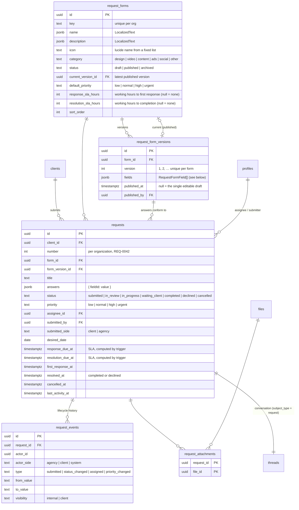
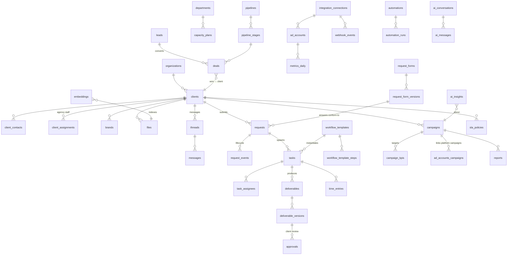

# Data Model

Status: **Phases 0–2**. Conventions from `CLAUDE.md §6`: plural `snake_case` tables, `uuid` PKs,
`timestamptz` UTC, `organization_id` on tenant-scoped tables, `LocalizedText = jsonb {ar, en}`,
`created_at` / `updated_at` on every mutable table (`updated_at` maintained by trigger).

## 1. Phase 0 ERD

```mermaid
erDiagram
  organizations ||--o{ organization_members : has
  organizations ||--o{ clients : serves
  organizations ||--o{ roles : defines
  organizations ||--o{ departments : has
  organizations ||--o{ invitations : issues
  organizations ||--o{ organization_features : configures
  organizations ||--o{ domain_events : records
  organizations ||--o{ activity_log : records
  organizations ||--o{ notifications : scopes

  auth_users ||--|| profiles : "1:1"
  profiles ||--o{ organization_members : "member of"
  clients ||--o{ organization_members : "client users"

  roles ||--o{ role_permissions : grants
  permissions ||--o{ role_permissions : "granted by"
  roles ||--o{ user_roles : "assigned via"
  profiles ||--o{ user_roles : holds
  clients |o--o{ user_roles : "client-scoped"
  permissions ||--o{ user_permission_overrides : ""
  profiles ||--o{ user_permission_overrides : ""

  departments ||--o{ department_members : ""
  profiles ||--o{ department_members : ""

  invitations }o--o{ roles : "pre-assigns (role_ids)"

  feature_flags ||--o{ organization_features : ""

  profiles ||--o{ notifications : receives
  profiles ||--o{ notification_preferences : sets

  organizations {
    uuid id PK
    text slug UK
    jsonb name "LocalizedText"
    text default_locale "ar"
    text default_timezone "Asia/Riyadh"
    char3 default_currency "SAR"
    text logo_path
    jsonb settings
  }
  profiles {
    uuid id PK "= auth.users.id"
    text full_name
    text email "mirror of auth email"
    text phone "E.164"
    text avatar_path
    text locale "ar | en"
    text theme "system | light | dark"
    text timezone
    text calendar "gregory | islamic-umalqura"
    timestamptz onboarded_at
  }
  organization_members {
    uuid id PK
    uuid organization_id FK
    uuid user_id FK
    text user_type "agency | client"
    uuid client_id FK "required when client"
    text job_title
    text status "active | deactivated"
    uuid invited_by FK
    timestamptz joined_at
  }
  clients {
    uuid id PK
    uuid organization_id FK
    jsonb name "LocalizedText"
    text slug
    text status "active | archived"
    text logo_path
  }
  permissions {
    text key PK "resource:action"
    text resource
    text action
    text side "agency | client"
    jsonb label "LocalizedText"
    jsonb description "LocalizedText"
    text module
    int sort_order
  }
  roles {
    uuid id PK
    uuid organization_id FK
    text key "super_admin, ..."
    jsonb name "LocalizedText"
    jsonb description
    text side "agency | client"
    bool is_system
    bool is_locked "Super Admin"
  }
  role_permissions {
    uuid role_id PK, FK
    text permission_key PK, FK
  }
  user_roles {
    uuid id PK
    uuid organization_id FK
    uuid user_id FK
    uuid role_id FK
    uuid client_id FK "null for agency roles"
    uuid assigned_by FK
  }
  user_permission_overrides {
    uuid id PK
    uuid organization_id FK
    uuid user_id FK
    text permission_key FK
    text effect "grant | deny"
    text reason
  }
  departments {
    uuid id PK
    uuid organization_id FK
    text key "design, video, ..."
    jsonb name "LocalizedText"
    text color "token name"
    text icon "lucide name"
    int sort_order
    bool is_archived
  }
  department_members {
    uuid department_id PK, FK
    uuid user_id PK, FK
    uuid organization_id FK
    bool is_lead
  }
  invitations {
    uuid id PK
    uuid organization_id FK
    text email
    text user_type
    uuid client_id FK
    uuid_array role_ids
    uuid department_id FK
    text locale "email language"
    text token_hash UK "sha256"
    text status "pending | accepted | revoked | expired"
    timestamptz expires_at
    int send_count
    timestamptz last_sent_at
    uuid invited_by FK
    uuid accepted_by FK
    timestamptz accepted_at
  }
  feature_flags {
    text key PK
    text module
    bool default_enabled
    jsonb description
  }
  organization_features {
    uuid organization_id PK, FK
    text flag_key PK, FK
    bool enabled
    jsonb config
    uuid updated_by FK
  }
  domain_events {
    uuid id PK "uuid v7"
    uuid organization_id FK
    text type
    text aggregate_type
    uuid aggregate_id
    uuid client_id
    uuid actor_id
    jsonb payload
    int version
    timestamptz occurred_at
  }
  activity_log {
    bigint id PK
    uuid organization_id FK
    uuid actor_id
    text action "insert | update | delete"
    text table_name
    uuid record_id
    jsonb before
    jsonb after
    text[] changed_fields
    text request_id
    inet ip
    timestamptz created_at
  }
  notifications {
    uuid id PK
    uuid organization_id FK
    uuid user_id FK
    text type
    text category
    jsonb params
    text link
    uuid event_id FK
    timestamptz read_at
    timestamptz created_at
  }
  notification_preferences {
    uuid user_id PK, FK
    uuid organization_id PK, FK
    text category PK
    bool in_app
    bool email
  }
```

Supporting (not in diagram): `rate_limits (key, window_start, count)` — used by auth rate limiting;
`domain_event_deliveries (event_id, consumer, processed_at, attempts, last_error)` — created in Phase 0, used from Phase 1.

### Key constraints & indexes

- `organization_members`: unique `(organization_id, user_id)`; check `user_type='client' ⇔ client_id is not null`.
- `roles`: unique `(organization_id, key)`; `user_roles`: unique `(user_id, role_id, coalesce(client_id, nil))`;
  trigger ensures `role.side` matches member `user_type`, and client roles carry the member's `client_id`.
- `invitations`: partial unique `(organization_id, lower(email)) where status = 'pending'`.
- `department_members`: only `agency` members (trigger check).
- `activity_log`, `domain_events`: append-only (no update/delete policies; revoke `update, delete` from `authenticated`).
  Index `(organization_id, created_at desc)`, `(table_name, record_id)`, `(type, occurred_at)`.
- `notifications`: index `(user_id, read_at nulls first, created_at desc)`; added to `supabase_realtime` publication.
- All FK columns indexed (RLS joins rely on them).

### Audited tables (generic `app.audit_trigger`)

`organizations`, `organization_members`, `profiles`, `clients`, `roles`, `role_permissions`, `user_roles`,
`user_permission_overrides`, `departments`, `department_members`, `invitations` (token_hash redacted),
`organization_features`. Excluded: high-volume/self-describing tables (`notifications`, `domain_events`, `activity_log`).

## 2. Seeded reference data

### Permission catalog (Phase 0)

| Resource | Actions | Side |
|---|---|---|
| `organization` | `read`, `update` | agency |
| `users` | `read`, `invite`, `update`, `deactivate` | agency |
| `invitations` | `read`, `create`, `resend`, `revoke` | agency |
| `roles` | `read`, `create`, `update`, `delete`, `assign` | agency |
| `permissions` | `override` | agency |
| `departments` | `read`, `manage` | agency |
| `clients` | `read_all`, `read_assigned`, `manage` | agency |
| `feature_flags` | `manage` | agency |
| `audit_log` | `read` | agency |
| `design_system` | `view` | agency |
| `portal` | `access` | client |
| `client_users` | `read`, `invite`, `manage` | client |

Later phases append to the catalog (e.g. `requests:create`, `tasks:assign`, `campaigns:read`, `leads:manage`).

### System roles & default grants

| Role (key) | Side | Default permissions |
|---|---|---|
| Super Admin (`super_admin`) | agency | **all** (locked) |
| Admin / Operations Manager (`admin`) | agency | all agency permissions except `feature_flags:manage` |
| Account Manager (`account_manager`) | agency | `users:read`, `departments:read`, `clients:read_assigned`, `invitations:read/create/resend/revoke` (client invites only — enforced by RLS on `user_type`), `design_system:view` |
| Team Lead (`team_lead`) | agency | `users:read`, `departments:read`, `clients:read_all`, `design_system:view` |
| Specialist (`specialist`) | agency | `users:read`, `departments:read`, `clients:read_assigned` |
| Client Owner (`client_owner`) | client | `portal:access`, `client_users:read/invite/manage` |
| Client Member (`client_member`) | client | `portal:access`, `client_users:read` |
| Client Viewer (`client_viewer`) | client | `portal:access` |

Everyone can always read/update **their own** profile and notification preferences (not permission-gated).

### Departments

Design (`design`), Video (`video`), Content (`content`), Media Buying (`media_buying`), Account Management (`account_management`).

### Dev seed (`pnpm db:reset`)

1 organization ("Demo Agency" / "وكالة تجريبية"), 10 agency users spread across departments with every
agency role represented, 1 demo client with 3 client users (Owner, Member, Viewer), a few pending/expired
invitations, sample notifications. All seed users: password `Passw0rd!` (local only), emails `@demo.local`.

## 3. RLS strategy

**Principles**

1. `alter table … enable row level security` on every table, **including** reference tables (`permissions`,
   `feature_flags` → `select` for `authenticated`, no writes).
2. Policies are written per command (`select`, `insert`, `update`, `delete`), never `for all`, so each can be
   tested and reasoned about separately.
3. Policies only call `app.*` helper functions (security definer, `search_path=''`), wrapped in `(select …)`
   so Postgres evaluates them once per statement.
4. Tenant isolation first: every policy on a tenant table includes `app.is_org_member(organization_id)`
   (implied by `has_permission`, which checks membership).
5. Side isolation: agency-only tables additionally require `app.is_agency_member(organization_id)`.
6. `anon` gets nothing, except the invitation lookup RPC (`app.get_invitation_preview(token)`, returns minimal
   fields: org name, email masked, status) — no direct table access.
7. Append-only tables: `insert` via helper/trigger only; no `update`/`delete` for anyone but `service_role`.

**Representative policies**

| Table | select | insert / update / delete |
|---|---|---|
| `profiles` | self; or agency member of a shared org with `users:read`; client users see profiles of members of the same client + their assigned agency contacts (Phase 1) | update self only (and `users:update` for admin fields via RPC) |
| `organization_members` | self row; `users:read` (agency); `client_users:read` scoped to same `client_id` | via RPC/actions: `users:update`, `users:deactivate`; client side `client_users:manage` on same client, never agency rows |
| `roles`, `role_permissions` | `roles:read` (agency); client users can read client-side roles (for their team page) | `roles:create/update/delete`; locked role rows immutable (trigger + policy) |
| `user_roles` | self; `roles:read` | `roles:assign`; client owners may assign client roles within own client; nobody can grant a role containing permissions they don't hold (anti-escalation trigger) |
| `user_permission_overrides` | self; `roles:read` | `permissions:override` (anti-escalation applies) |
| `departments`, `department_members` | agency members | `departments:manage` |
| `invitations` | `invitations:read` (agency); client owners see their client's invites | `invitations:create/resend/revoke`; client owners only for `user_type='client'` + own `client_id`; account managers only for client invites |
| `clients` | `clients:read_all`, or `read_assigned` + assignment (Phase 1 table), or client member of that client | `clients:manage` |
| `organization_features` | org members (read — the UI needs flags) | `feature_flags:manage` |
| `domain_events` | none for users (service/consumers only) | insert via `app.emit_event()` security definer |
| `activity_log` | `audit_log:read` | trigger only |
| `notifications` | `user_id = auth.uid()` | update self (`read_at` only, column-level grant); insert via `app.notify()` |
| `notification_preferences` | self | self |

**Anti privilege-escalation**: a user may only grant (via role edit, role assignment, override, or invitation)
permissions that they themselves hold; Super Admin is exempt. Enforced by a trigger calling
`app.assert_can_grant(permission_keys)` so it holds even for direct API calls.

**Testing** (`tests/db`): for each table, as each seeded persona (super admin, admin, account manager, specialist,
client owner, client viewer, other-org user, anon) assert allowed and denied `select/insert/update/delete`.
Plus a meta-test: every table in `public`/`app` schemas has RLS enabled and ≥ 1 policy.

## 3b. Phase 1 — client portal entities

**Client roles live on `client_users.role_id`** (ADR-018): a client user's role is scoped to one client, and a person
could belong to several clients with different roles. `user_roles` stays agency-only.

**Package usage** is a ledger (`package_usage_entries`) rather than counters: Phase 3 deliverables and revision rounds
append rows with `source_type/source_id`, and `getPackageUsage()` sums them per item type for the current period.

**Visibility rules** (enforced by RLS, not only by queries):

| Item | Agency staff with access to the client | Client users of that client |
|---|---|---|
| `files` / `file_folders` with `visibility = 'client'` | ✅ | ✅ (not soft-deleted; parent folder also client-visible) |
| `files` / `file_folders` with `visibility = 'internal'` | ✅ | ❌ |
| `threads` with `visibility = 'internal'` | ✅ | ❌ |
| `comments` with `visibility = 'internal'` (internal notes inside a client thread) | ✅ | ❌ |
| `client_notes` | ✅ | ❌ |
| Writing files / messages | `files:upload`, `messages:send` | `portal_files:upload`, `portal_messages:send` (Viewer has neither) |

Triggers force every client-scoped row to carry its client's `organization_id`, and force comments in an internal
thread to be internal, so a crafted request can't leak data across tenants or visibility levels.

## 3c. Phase 2 — requests

**Form definitions.** `request_form_versions.fields` is an ordered array of
`{ id, type, label: LocalizedText, help?: LocalizedText, required, options?: [{ value, label }], min?, max?, maxLength? }`
with `type ∈ short_text | long_text | number | date | single_select | multi_select | checkbox | url`. One Zod builder
(`buildAnswersSchema`) turns a version into the validator used by the portal form *and* the server action. Each form has at
most one draft version (partial unique index); publishing freezes it (trigger: published rows are immutable and cannot be
deleted) and points `current_version_id` at it. Requests keep the `form_version_id` they were submitted with, so old
requests always render with the fields they were answered against.

**Lifecycle.** Allowed transitions (mirrored by `app.request_transition_allowed()` in SQL and `requestTransitions` in TS):

| From | Agency may move to | Client may move to |
|---|---|---|
| `submitted` | `in_review`, `in_progress`, `declined` | `cancelled` |
| `in_review` | `in_progress`, `waiting_client`, `declined` | `cancelled` |
| `in_progress` | `waiting_client`, `completed`, `in_review` | — |
| `waiting_client` | `in_progress`, `completed`, `declined` | `cancelled` (a client reply moves it back to `in_progress` automatically) |
| `completed`, `declined`, `cancelled` | `in_progress` / `in_review` (reopen) | — |

**Triggers** (hand-written migration): per-org `number` (advisory lock), SLA due dates from the form's hours counted on
working days only (Friday/Saturday skipped, organization time zone) — `app.sla_due()`; `first_response_at` on the first
agency status change or client-visible agency reply; `resolved_at` / `cancelled_at`; `last_activity_at`. Client users can
only insert `submitted` requests with `normal`/`high` priority and no assignee, and can only update `status → cancelled`.
Priority and assignee changes need `requests:triage`; the assignee must be an active agency member. Every insert/update
writes `request_events` (status → client-visible; assignment and priority → internal). An `after insert` trigger creates
the request's conversation thread; comments in it bump `last_activity_at`.

**RLS**

| Table | Agency | Client users of that client |
|---|---|---|
| `request_forms` | read: members; write: `request_forms:manage` | read: `status = 'published'` |
| `request_form_versions` | read: members; write drafts: `request_forms:manage` | read: published versions |
| `requests` | read: `requests:read` + client access; insert/update: `requests:triage`, or `requests:update` on requests assigned to them | read: member; insert/cancel: `portal_requests:create` (Viewer: read only) |
| `request_events` | read with the request | read `visibility = 'client'` only |
| `request_attachments` | read with the request; insert by the file's uploader | same |

Internal notes on a request are `comments.visibility = 'internal'` in the request thread (existing messaging RLS).

**Dispatcher columns.** `domain_event_deliveries` gains `created_at`, `next_attempt_at` (backoff) and `locked_until`
(claim lease) — see ARCHITECTURE §7.

## 4. Forward-looking sketch (all phases — not built in Phase 0)

| Phase | Main entities | Notes |
|---|---|---|
| 1 Portal | `clients` (extended), `client_assignments`, `brands`, `files`, `folders`, `threads`, `messages`, `thread_participants` | Storage bucket per org, path `org/<org>/client/<client>/…`; Realtime for messages |
| 2 Requests | **Built** — see §3c | Form definition versioned so old requests render correctly |
| 3 Tasks | `workflow_templates`, `workflow_template_steps`, `tasks`, `task_assignees`, `task_dependencies`, `deliverables`, `deliverable_versions`, `approvals`, `comments`, `time_entries` | Status machines per template; approvals by client users |
| 4 Campaigns | `campaigns`, `campaign_kpis`, `campaign_channels`, `metrics_daily` (partitioned by month), `reports`, `report_sections` | Metrics are append-heavy → partitioning, materialized views |
| 5 Ops | `sla_policies`, `sla_breaches`, read models/views for Client 360 & dashboard | Mostly views over earlier phases |
| 6 CRM | `leads`, `pipelines`, `pipeline_stages`, `deals`, `deal_activities`, `capacity_plans`, `availability` | Won deal → creates client |
| 7 Integrations | `integration_connections` (tokens in Supabase Vault), `ad_accounts`, `social_accounts`, `webhook_events`, `sync_jobs`, `automations`, `automation_runs`, `whatsapp_templates` | Automation triggers = `domain_events` types |
| 8 AI | `ai_insights`, `ai_recommendations`, `ai_conversations`, `ai_messages`, `embeddings` (pgvector) | Every AI output linked to source records for traceability |
